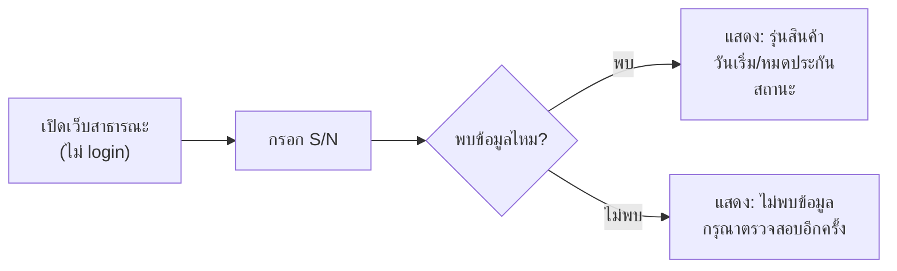

# Architecture & Design — SME Inventory & Order Management
## สัปดาห์ 1 ของแผนงาน 8 สัปดาห์ · อิงจาก Requirement Package v1.3 (Baseline + CR-001~005)

> เอกสารนี้คือคำตอบของ Technical Evidence Area "Architecture" (Deck 05 ตาราง Technical Evidence) — ครอบคลุม Context/Component Diagram, Data Model, API/Interface Contract, Design Decisions

---

## 1. Architecture Pattern

### ADR-001: ระบบเดียว Role-Based แทนการแยก 3 แอป

| หัวข้อ | รายละเอียด |
|---|---|
| **Context** | ต้องตัดสินใจว่าเว็บสาธารณะ (เช็คประกัน), เว็บ B2B (สาขา), และ Backoffice (HQ) จะเป็น 1 ระบบหรือ 3 ระบบแยกกัน — ทีมยืนยันแล้วว่าต้องการระบบเดียว |
| **Decision** | **Client-Server + Layered Architecture** เป็น monolith เดียว แบ่งการเข้าถึงด้วย **Role-Based Access Control (RBAC)** 3 โซน: `/public` (ไม่ต้อง auth), `/branch` (auth, role=BranchStaff), `/admin` (auth, role=Admin) |
| **Alternatives พิจารณา** | ① แยก 3 ระบบอิสระ — ข้อดี separation ชัดเจน, ข้อเสีย ทีมเล็กดูแล 3 codebase ไม่ไหวใน 8 สัปดาห์ + ข้อมูลต้อง sync ข้ามระบบ (เพิ่มความเสี่ยง data consistency ซึ่งเป็นปัญหาที่พยายามหลีกเลี่ยงอยู่แล้ว) · ② Microservices แยกตาม domain — overkill สำหรับ scope นี้ และ distributed transaction จะทำให้ NFR-REL-01 (atomic) ยากขึ้นแทนที่จะง่ายขึ้น |
| **Consequences** | ✅ Deploy ครั้งเดียว, ทดสอบ NFR-SEC-02 ตรงไปตรงมา (middleware เดียวคุมทุก route) · ⚠️ Risk: backend ล่มกระทบทั้ง 3 หน้าบ้านพร้อมกัน — ยอมรับ risk นี้เพราะ scope เล็กและมีเวลาจำกัด (trade-off ที่ตั้งใจเลือก ไม่ใช่มองข้าม) |

**เลเยอร์ภายใน (Layered):**
```
Presentation   → Web UI (Public / Branch / Admin — แยกด้วย route + role guard)
Business Logic → Service layer (StockService, SaleService, PRService, AuditService)
Data Access    → Repository layer + DB (transaction boundary อยู่ที่นี่)
```

---

## 2. Quality Attribute Scenarios (ตัวอย่างการเขียน NFR ให้ทดสอบได้ตามรูปแบบ Source→Stimulus→Environment→Response)

| องค์ประกอบ | Scenario #1 (NFR-REL-01) | Scenario #2 (NFR-PERF-01) |
|---|---|---|
| **แหล่งที่มา (Source)** | พนักงาน 2 สาขาพร้อมกัน | ผู้ใช้ภายนอกจำนวนมาก |
| **กระตุ้น (Stimulus)** | กดขาย S/N เดียวกันในเวลาไล่เลี่ยกัน (หรือกดซ้ำเพราะเน็ตช้า) | เข้าหน้าเช็คประกันพร้อมกัน 200 คน |
| **สภาพแวดล้อม (Environment)** | Production, peak hours | Production, peak hours |
| **การตอบสนอง (Response)** | ระบบอนุญาตให้สำเร็จได้เพียง 1 request เท่านั้น รายการที่เหลือได้ error ที่ชัดเจน | ระบบตอบกลับภายใน 2 วินาทีที่ P95 |

---

## 3. ADR-002: กลยุทธ์จัดการ Concurrency (NFR-REL-01)

| หัวข้อ | รายละเอียด |
|---|---|
| **Context** | ต้องป้องกันการขาย/จ่าย S/N ซ้ำเมื่อมี concurrent request — นี่คือ "ความท้าทายหลัก" ที่โจทย์ระบุไว้ตรง ๆ (Transaction consistency) |
| **Decision** | ใช้ **2 กลไกร่วมกัน**:<br>**(1) Conditional Update ระดับ DB** — `UPDATE items SET status='Sold' WHERE id=? AND status='In Stock'` ห่อด้วย DB transaction แล้วตรวจ affected-row count: ถ้า 0 แถว = มีคนอื่นขายไปก่อนแล้ว ให้คืน error ทันที ไม่ต้อง lock ยาว<br>**(2) Idempotency Key ระดับ Application** — endpoint `POST /api/sales` รับ `Idempotency-Key` (ตาม Deck 03 สไลด์ 17) ถ้า key ซ้ำ (retry จากเน็ตช้า) server คืนผลลัพธ์เดิมแทนสร้างรายการใหม่ |
| **Alternatives พิจารณา** | Pessimistic locking (`SELECT ... FOR UPDATE`) — ป้องกันชัดเจนแต่ block นานเกินจำเป็นสำหรับ scale เล็กของโปรเจกต์นี้ · Distributed lock (Redis) — overkill สำหรับ single-instance monolith |
| **Consequences** | ต้องเขียน concurrency test เจาะจง (ยิง N concurrent request ไปที่ S/N เดียว ตรวจว่าสำเร็จแค่ 1) — งานนี้อยู่ในสัปดาห์ 4 ของแผน และเป็นหลักฐานสำคัญสำหรับ rubric "Architecture & Design: อธิบาย trade-off ได้" |

---

## 4. ER Model

```mermaid
erDiagram
    BRANCH ||--o{ ITEM : "ที่ตั้งปัจจุบัน"
    BRANCH ||--o{ USER : "สังกัด"
    BRANCH ||--o{ BRANCH_SKU : "ตั้งค่า reorder"
    BRANCH ||--o{ SALE : "ขายที่"
    BRANCH ||--o{ PURCHASE_REQUEST : "สร้างคำขอ"
    PRODUCT ||--o{ ITEM : "เป็นรุ่นของ"
    PRODUCT ||--o{ BRANCH_SKU : "ถูกตั้งค่าที่"
    PRODUCT ||--o{ PURCHASE_REQUEST : "สั่งซื้อ"
    ITEM ||--o| SALE : "ถูกขายเป็น"
    USER ||--o{ AUDIT_LOG : "กระทำโดย"
    PURCHASE_REQUEST ||--o| PURCHASE_ORDER : "อนุมัติเป็น"

    USER {
        int id PK
        string username
        string password_hash
        string role "Admin | BranchStaff"
        int branch_id FK "null สำหรับ Admin"
    }
    BRANCH {
        int id PK
        string name
        string address
    }
    PRODUCT {
        int id PK
        string category "RAM | Mainboard | CPU"
        string brand
        string model
        string spec
        int warranty_months
    }
    BRANCH_SKU {
        int id PK
        int branch_id FK
        int sku_id FK
        int reorder_point "แก้ตาม CR-002"
    }
    ITEM {
        int id PK
        int sku_id FK
        string serial_number UK
        int branch_id FK
        string status "InStock|Sold"
        datetime received_at
    }
    SALE {
        int id PK
        int item_id FK "unique - ขายได้ครั้งเดียว"
        string buyer_name
        string buyer_phone
        int branch_id FK
        datetime sold_at
        datetime warranty_expires_at "คำนวณ = sold_at + warranty_months"
        string idempotency_key UK
    }
    PURCHASE_REQUEST {
        int id PK
        int branch_id FK
        int sku_id FK
        int quantity
        string status "Pending|Approved|Rejected"
        int requested_by FK
        datetime requested_at
        int decided_by FK
        datetime decided_at
        string reject_reason
    }
    PURCHASE_ORDER {
        int id PK
        int pr_id FK UK
        int created_by FK
        datetime created_at
    }
    AUDIT_LOG {
        int id PK
        int actor_user_id FK
        string action
        string entity_type
        int entity_id
        json before_value
        json after_value
        datetime occurred_at
    }
```

**หมายเหตุการออกแบบ:**
- `BRANCH_SKU` คือ associative entity แก้ปัญหา M:N ระหว่าง Branch และ Product (ตาม Deck 02 สไลด์ 14) — เก็บ `reorder_point` ตาม CR-002 (ต่อ SKU ต่อสาขา)
- `SALE.item_id` เป็น unique เพื่อบังคับกฎธุรกิจ "1 ชิ้นขายได้ครั้งเดียว" ที่ระดับ schema ไม่ใช่แค่ระดับโค้ด — เป็นแนวป้องกันชั้นที่ 2 ร่วมกับ ADR-002
- `AUDIT_LOG.before_value`/`after_value` เป็น JSON เพื่อให้ยืดหยุ่นบันทึกการเปลี่ยนแปลงของ entity ใดก็ได้โดยไม่ต้องมีตารางแยกทุก entity

---

## 5. REST API Specification

| Endpoint | Method | Auth/Role | ตอบสนอง FR/NFR | หมายเหตุ |
|---|---|---|---|---|
| `/api/public/warranty/{serial}` | GET | ไม่ต้อง auth | FR-006, NFR-SEC-01 | คืนเฉพาะ model/warranty status — **ไม่มี field buyer เลยใน response schema** |
| `/api/auth/login` | POST | ไม่ต้อง auth | FR-007 | คืน JWT พร้อม role + branch_id ฝัง (server-issued ไม่เชื่อ client) |
| `/api/products` | GET | Admin, Branch (read) | FR-001, FR-008 | Branch เห็นได้แต่แก้ไม่ได้ (บังคับที่ middleware) |
| `/api/products` | POST / PUT | **Admin only** | FR-001 | ปฏิเสธ 403 ถ้า role=Branch (NFR-SEC-02) |
| `/api/items` (รับเข้าสต็อก) | POST | **Admin only** | FR-002 | body: `{sku_id, serial_number, branch_id}` — 409 ถ้า serial ซ้ำ |
| `/api/stock` | GET | Admin, Branch (เฉพาะสาขาตน) | FR-003, FR-008 | เรียลไทม์จาก COUNT(items WHERE status='InStock') |
| `/api/sales` | POST | **Branch only** (เฉพาะสาขาตน) | FR-004, FR-005, NFR-REL-01 | ต้องมี header `Idempotency-Key` — ดู ADR-002 |
| `/api/branch-sku/{branch_id}/{sku_id}` | GET/PUT | Admin (ตั้งค่า), Branch (read) | FR-012 (reorder_point) | Branch เห็นค่าที่ตั้งไว้แต่แก้ไม่ได้ |
| `/api/purchase-requests` | POST | **Branch only** | FR-009 | สร้าง PR สถานะ Pending + trigger notification |
| `/api/purchase-requests` | GET | Admin (ทั้งหมด), Branch (เฉพาะของตน) | FR-009, FR-010 | |
| `/api/purchase-requests/{id}/approve` | POST | **Admin only** | FR-010 | สร้าง PurchaseOrder อัตโนมัติ |
| `/api/purchase-requests/{id}/reject` | POST | **Admin only** | FR-010 | body: `{reason}` — reason เป็น field บังคับ |
| `/api/audit-log` | GET | **Admin only** | FR-011, NFR-MAINT-01 | filter ตาม entity_type/entity_id/date range, index บน serial_number |
| `/api/alerts/low-stock` | GET | **Admin only** | FR-012 | คำนวณจาก stock ปัจจุบัน เทียบ reorder_point ต่อ branch_sku |
| `/api/admin/purge-old-buyer-data` | POST | **Admin only** | NFR-PRIV-01 | Manual trigger — anonymize buyer_name/phone ของ Sale ที่ warranty_expires_at เกิน 3 ปี |

**หลักการร่วมทุก endpoint ที่แก้ไขข้อมูล:** ดึง `branch_id` จาก JWT token เสมอ **ไม่เชื่อ `branch_id` ที่ client ส่งมาใน request body** — ป้องกัน tampering (ดู STRIDE ข้อ T ด้านล่าง)

---

## 6. User Flow (3 Persona)

### End Customer — เช็คประกัน (ตรงกับ US-01)


### Branch Staff — บันทึกขาย + สร้าง PR (ตรงกับ US-04, US-05, US-06)
1. Login → เข้าหน้า Branch Dashboard (เห็นเฉพาะสต็อกสาขาตน — FR-008)
2. **บันทึกขาย:** เลือก S/N ที่สถานะ In Stock → กรอกข้อมูลผู้ซื้อ → ยืนยัน → ระบบตรวจ atomic ตาม ADR-002 → สำเร็จ/แจ้ง "ขายไปแล้ว"
3. **สร้าง PR:** เห็นสต็อกใกล้ reorder point (แจ้งเตือนจาก FR-012 ถ้าเวลาเหลือ) → เลือก SKU + จำนวน → ส่งคำขอ → รอ HQ อนุมัติ

### HQ Admin — จัดการสต็อก + อนุมัติ PR (ตรงกับ US-02, US-03, US-07, US-08)
1. Login → เข้า Backoffice Dashboard (เห็นภาพรวมทุกสาขา)
2. **จัดการสินค้า:** เพิ่ม SKU ใหม่พร้อมระยะประกัน (US-02) → รับสินค้าเข้าสต็อกทีละ S/N (US-03)
3. **จัดการ PR:** เห็นรายการ PR รอดำเนินการ → ตรวจสอบ → อนุมัติ (สร้าง PO อัตโนมัติ) หรือปฏิเสธ (ต้องระบุเหตุผล) (US-07)
4. **ตรวจ Dashboard:** เห็นการแจ้งเตือนสินค้าใกล้หมดต่อสาขา (US-08) + audit log ค้นหาย้อนหลัง (FR-011)

---

## 7. STRIDE Threat Model

| # | Threat | สถานการณ์เจาะจงของระบบนี้ | Mitigation |
|---|---|---|---|
| **S** | Spoofing | พนักงานสาขาปลอมแปลง role เป็น Admin โดยแก้ payload ฝั่ง client | JWT เซ็นด้วย server secret, role ฝังใน token ที่ client แก้ไม่ได้โดยไม่ทำให้ signature เสีย |
| **T** | Tampering | สาขายิง `PUT /products` หรือ `POST /items` ตรงเพื่อแก้สต็อกหลักโดยไม่ผ่าน UI | NFR-SEC-02 — role check middleware บังคับที่ **ทุก** endpoint ฝั่ง server (403 ถ้าไม่ใช่ Admin) |
| **T** | Tampering | แก้ `branch_id` ใน request body ตอนสร้าง Sale เพื่อให้ยอดขายไปโผล่สาขาอื่น | Server ดึง `branch_id` จาก JWT เสมอ ไม่เชื่อค่าที่ client ส่งมาใน body |
| **R** | Repudiation | Admin ปฏิเสธว่าไม่ได้เป็นคนอนุมัติ PR ฉบับหนึ่ง | AuditLog (FR-011) บันทึก actor + timestamp ทุก action เปลี่ยนสถานะ — ใช้เป็นหลักฐาน |
| **I** | Information Disclosure | หน้าเช็คประกันสาธารณะรั่วชื่อ/เบอร์โทรผู้ซื้อ | NFR-SEC-01 — response schema ของ `/api/public/warranty` ไม่มี field buyer เลย ทดสอบด้วย schema-level test |
| **I** | Information Disclosure | Error message เปิดเผย stack trace หรือ query จริงเมื่อเกิด exception | Fail Securely (Deck 03 สไลด์ 26) — custom error handler คืนข้อความทั่วไปให้ client, log รายละเอียดจริงไว้ฝั่ง server เท่านั้น |
| **D** | Denial of Service | มีคนยิง S/N สุ่มจำนวนมากไปที่ endpoint สาธารณะ (scraping/enumeration) | Rate limiting ต่อ IP บน `/api/public/warranty/*` |
| **E** | Elevation of Privilege | Token ของพนักงานสาขาที่หมดอายุ/ถูกขโมยถูกใช้เข้าถึง endpoint ของ Admin | JWT TTL สั้น + ตรวจ role ทุก request (ไม่ใช่แค่ตอน login) |

---

## 8. ADR-003: Technology Stack

| หัวข้อ | รายละเอียด |
|---|---|
| **Context** | ต้องเลือก stack ที่ทีมนักศึกษาสร้างให้เสร็จได้จริงใน 6 สัปดาห์ที่เหลือ พร้อมโชว์ CI/CD, testing, concurrency handling ตาม ADR-002 |
| **Decision** | **Backend:** Python 3.11+ · **FastAPI** · SQLAlchemy 2.0 (sync) · Alembic (migration) · `python-jose`/`PyJWT` (JWT auth) · `passlib[bcrypt]` (password hash) · `slowapi` (rate limiting)<br>**Database:** **PostgreSQL 15+** (Docker ตอน dev)<br>**Frontend:** **React + Vite** + Tailwind CSS + React Router (แยก route ตาม 3 role)<br>**Testing:** Pytest + httpx (backend) · Vitest (frontend ถ้าเวลาเหลือ)<br>**CI/CD:** GitHub Actions · **Deploy demo:** Render.com (free web service + free Postgres) |
| **เหตุผลหลัก** | ① **FastAPI สร้าง OpenAPI docs อัตโนมัติ** จาก code — ได้ "Contract-First API Documentation" (Deck 03 สไลด์ 18) แทบไม่ต้องเสียเวลาทำเพิ่ม ② **PostgreSQL รองรับ conditional `UPDATE ... RETURNING`** ที่ ADR-002 ต้องใช้ได้ตรงไปตรงมา และรองรับการทดสอบ concurrency จริง (connection pool จริง ไม่เหมือน SQLite ที่ lock ทั้งไฟล์) ③ Python เหมาะกับพื้นฐานทีมสาย Computer Engineering & AI และเครื่องมือ AI-assisted coding (ตาม ASO2 ของวิชา) รองรับ Python/FastAPI ดีมาก ช่วยเร่งความเร็วได้จริงใน 6 สัปดาห์ที่เหลือ |
| **Alternatives พิจารณา** | **Node.js + Express** — ใช้ได้ดีเช่นกัน แต่ไม่มี auto-OpenAPI docs ในตัว ต้องเพิ่ม library เอง · **Laravel (PHP)** — มี auth/middleware scaffolding ครบเช่นกัน แต่ถ้าทีมไม่คุ้น PHP จะเสียเวลาไปกับการเรียนภาษาใหม่ระหว่างโปรเจกต์ที่มี deadline |
| **Consequences** | ต้อง setup Docker Compose สำหรับ Postgres ตอน dev (เพิ่มขั้นตอนเล็กน้อยแต่คุ้มค่าเพราะ CI ก็ใช้ Postgres service container แบบเดียวกัน — environment parity ตาม Deck 04 สไลด์ 28) |

### โครงสร้าง Repository ที่แนะนำ
```
repo/
├── backend/
│   ├── app/
│   │   ├── models/        (SQLAlchemy models: User, Branch, Product, Item, Sale, ...)
│   │   ├── schemas/       (Pydantic — request/response, ทำให้ OpenAPI ชัดเจน)
│   │   ├── routers/       (แยกตาม resource: auth, products, items, stock, sales, purchase_requests, audit_log)
│   │   ├── services/      (business logic — StockService, SaleService ตาม ADR-002)
│   │   ├── deps.py        (auth/role dependency injection — จุดเดียวที่บังคับ NFR-SEC-02)
│   │   └── main.py
│   ├── alembic/           (migrations)
│   └── tests/
│       ├── unit/
│       ├── integration/
│       └── concurrency/   (test เฉพาะ ADR-002 — ยิง concurrent request จริง)
├── frontend/
│   └── src/
│       ├── pages/public/  (เช็คประกัน — ไม่ต้อง login)
│       ├── pages/branch/  (route guard role=BranchStaff)
│       └── pages/admin/   (route guard role=Admin)
├── .github/workflows/     (CI: lint → test → build)
└── docs/                  (เอกสารทั้งหมดจากบทสนทนานี้ + Appendix รูปโน้ตลายมือ)
```

## 9. Next: อัปเดต RTM

คอลัมน์ Design ใน [01-Requirements-Package.md](01-Requirements-Package.md) จะถูกเติมให้ชี้กลับมาที่เอกสารนี้ (ER entity / API endpoint ที่เกี่ยวข้องของแต่ละ FR/NFR) — ทำในขั้นถัดไป
