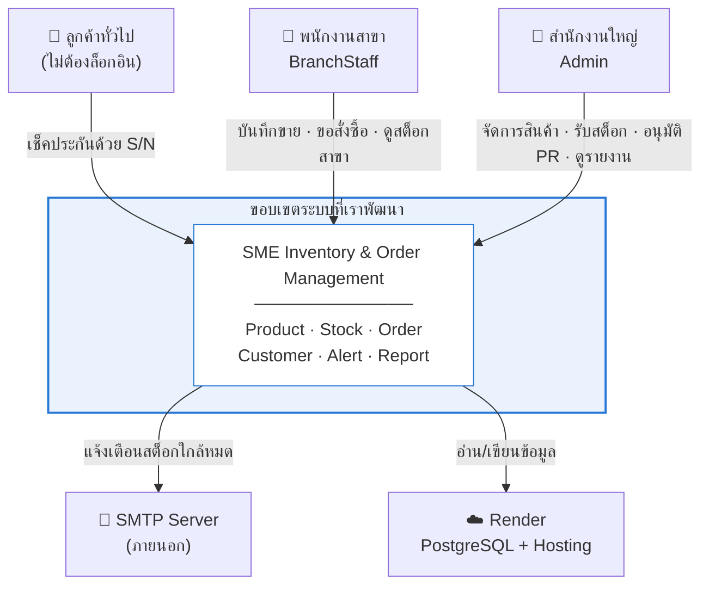
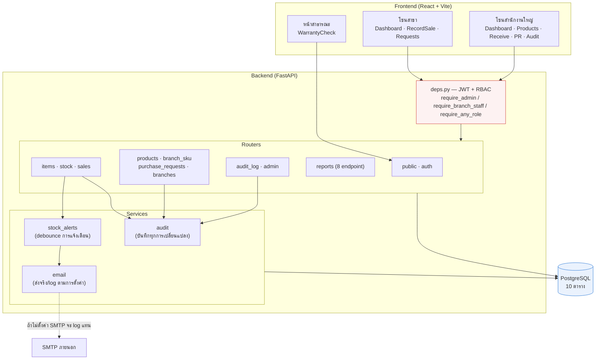
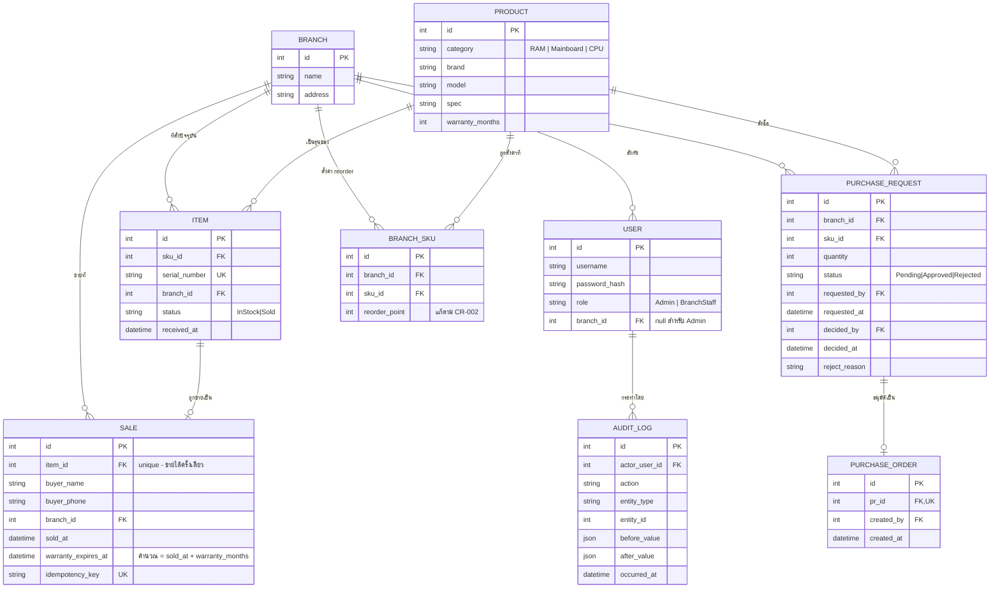
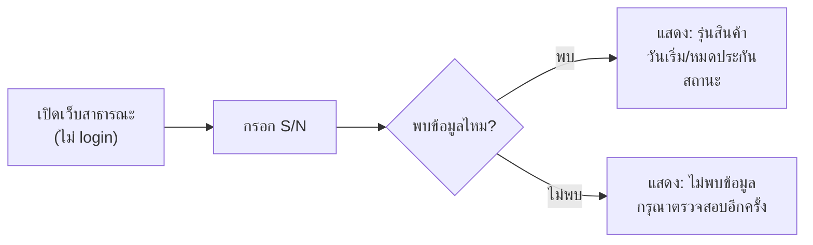
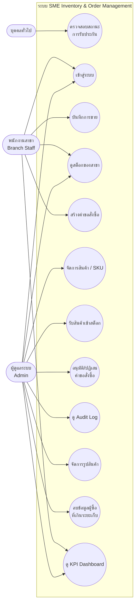
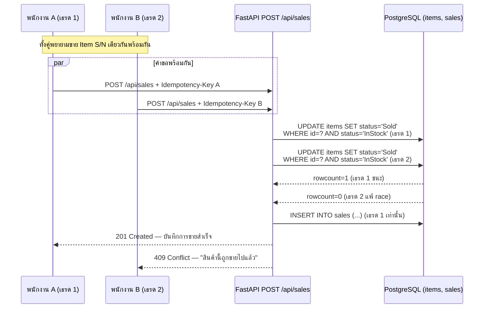
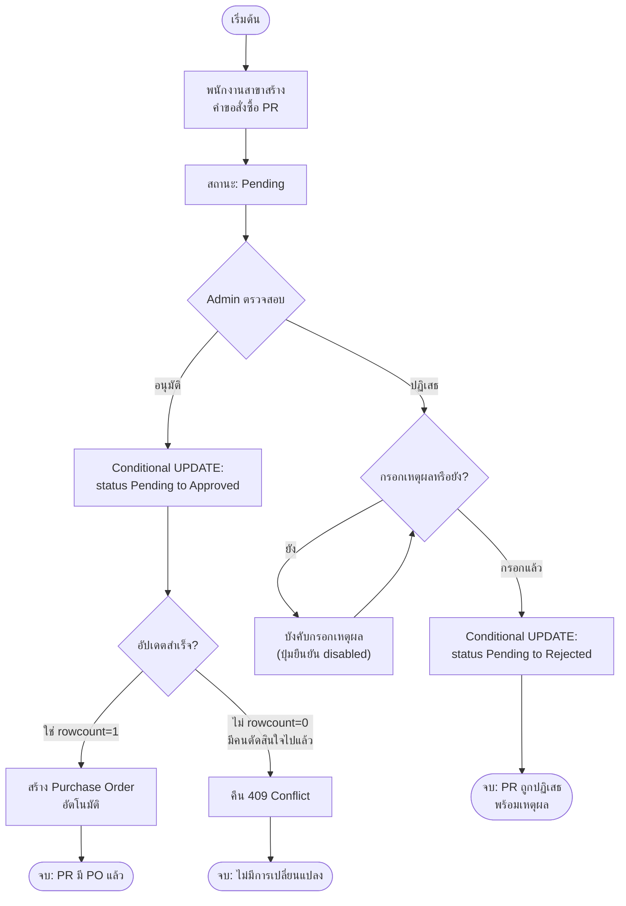

# Architecture & Design — SME Inventory & Order Management
## สัปดาห์ 1 ของแผนงาน 8 สัปดาห์ · อิงจาก Requirement Package v1.3 (Baseline + CR-001~005)

> เอกสารนี้คือคำตอบของ Technical Evidence Area "Architecture" (Deck 05 ตาราง Technical Evidence) — ครอบคลุม Context/Component Diagram, Data Model, API/Interface Contract, Design Decisions

---

## 1. Context Diagram — ขอบเขตระบบและสิ่งที่อยู่นอกระบบ

แสดงว่า **อะไรอยู่ในความรับผิดชอบของเรา และอะไรไม่ใช่** — เส้นแบ่งนี้สำคัญเพราะกำหนดว่า
เวลาอะไรพัง เราแก้เองได้หรือต้องพึ่งคนอื่น



**สิ่งที่อยู่นอกขอบเขต และผลที่ตามมา**

| ภายนอก | เราควบคุมไม่ได้ | รับมืออย่างไร |
|---|---|---|
| SMTP Server | ส่งอีเมลไม่สำเร็จ / ช้า | การขายต้องสำเร็จแม้ส่งอีเมลไม่ได้ — การแจ้งเตือนไม่อยู่ใน transaction เดียวกับการขาย |
| Render free tier | เครื่องหลับหลังไม่มีคนใช้ 15 นาที | request แรกช้า ~30-60 วินาที · ระบุไว้ใน README และ Release Notes ว่าเป็นพฤติกรรมปกติ |
| นาฬิกาของเบราว์เซอร์ผู้ใช้ | ตั้งเวลา/โซนเวลาผิดได้ | คำนวณสถานะประกันที่ **server** เสมอ ไม่ให้ client ตัดสิน |

---

## 2. Component Diagram — องค์ประกอบภายในและการไหลของข้อมูล



**จุดที่ตั้งใจออกแบบให้เป็นแบบนี้**

| องค์ประกอบ | เหตุผล |
|---|---|
| `deps.py` เป็นประตูเดียว | ทุก route ที่ต้องล็อกอินผ่านที่นี่ทั้งหมด — ตรวจสิทธิ์ที่เดียว ไม่กระจายไปตาม router (ถ้ากระจาย พลาดที่เดียวคือรั่ว) · หน้าสาธารณะเป็นทางเดียวที่ข้ามได้ และ schema บังคับไม่ให้ข้อมูลผู้ซื้อหลุด |
| `reports` แยกจาก router ข้อมูลดิบ | สรุปผลใน SQL ไม่ใช่ในเบราว์เซอร์ — router รายการมี `limit` ถ้าเอาไป group ต่อฝั่ง client กราฟจะคิดจากข้อมูลที่ถูกตัดไปแล้วโดยหน้าจอยังดูปกติ |
| `stock_alerts` เป็น service แยก | ถูกเรียกจากทั้งการรับเข้าและการขาย แต่**ยิงแจ้งเตือนได้เฉพาะฝั่งขาย** (`may_alert`) — เคยเป็นบั๊กจริงตอนทั้งสองฝั่งเรียกแบบเดียวกัน |
| `email` แยกจาก `stock_alerts` | ถ้าไม่ได้ตั้งค่า SMTP จะ log แทนการส่ง ทำให้ระบบทำงานได้โดยไม่ต้องมี credential — และ**ไม่มีใครต้องใส่รหัสผ่านอีเมลลงในเครื่องมือ AI** |

---

## 3. Architecture Pattern

### ADR-001: ระบบเดียว Role-Based แทนการแยก 3 แอป

| หัวข้อ | รายละเอียด |
|---|---|
| **Context** | ต้องตัดสินใจว่าเว็บสาธารณะ (เช็คประกัน), เว็บ B2B (สาขา), และ Backoffice (HQ) จะเป็น 1 ระบบหรือ 3 ระบบแยกกัน — ทีมยืนยันแล้วว่าต้องการระบบเดียว |
| **Decision** | **Client-Server + Layered Architecture** เป็น monolith เดียว แบ่งการเข้าถึงด้วย **Role-Based Access Control (RBAC)** 3 โซน: `/public` (ไม่ต้อง auth), `/branch` (auth, role=BranchStaff), `/admin` (auth, role=Admin) |
| **Alternatives พิจารณา** | ① แยก 3 ระบบอิสระ — ข้อดี separation ชัดเจน, ข้อเสีย ทีมเล็กดูแล 3 codebase ไม่ไหวใน 8 สัปดาห์ + ข้อมูลต้อง sync ข้ามระบบ (เพิ่มความเสี่ยง data consistency ซึ่งเป็นปัญหาที่พยายามหลีกเลี่ยงอยู่แล้ว) · ② Microservices แยกตาม domain — overkill สำหรับ scope นี้ และ distributed transaction จะทำให้ NFR-REL-01 (atomic) ยากขึ้นแทนที่จะง่ายขึ้น |
| **Consequences** | ✅ Deploy ครั้งเดียว, ทดสอบ NFR-SEC-02 ตรงไปตรงมา (middleware เดียวคุมทุก route) · ⚠️ Risk: backend ล่มกระทบทั้ง 3 หน้าบ้านพร้อมกัน — ยอมรับ risk นี้เพราะ scope เล็กและมีเวลาจำกัด (trade-off ที่ตั้งใจเลือก ไม่ใช่มองข้าม) |

**เลเยอร์ภายใน (Layered):**
```
Presentation   → Web UI (Public / Branch / Admin — แยกด้วย route + role guard)
Business Logic → Service layer (StockService, SaleService, PRService, AuditService)
Data Access    → Repository layer + DB (transaction boundary อยู่ที่นี่)
```

---

## 4. Quality Attribute Scenarios (ตัวอย่างการเขียน NFR ให้ทดสอบได้ตามรูปแบบ Source→Stimulus→Environment→Response)

| องค์ประกอบ | Scenario #1 (NFR-REL-01) | Scenario #2 (NFR-PERF-01) |
|---|---|---|
| **แหล่งที่มา (Source)** | พนักงาน 2 สาขาพร้อมกัน | ผู้ใช้ภายนอกจำนวนมาก |
| **กระตุ้น (Stimulus)** | กดขาย S/N เดียวกันในเวลาไล่เลี่ยกัน (หรือกดซ้ำเพราะเน็ตช้า) | เข้าหน้าเช็คประกันพร้อมกัน 200 คน |
| **สภาพแวดล้อม (Environment)** | Production, peak hours | Production, peak hours |
| **การตอบสนอง (Response)** | ระบบอนุญาตให้สำเร็จได้เพียง 1 request เท่านั้น รายการที่เหลือได้ error ที่ชัดเจน | ระบบตอบกลับภายใน 2 วินาทีที่ P95 |

---

## 5. ADR-002: กลยุทธ์จัดการ Concurrency (NFR-REL-01)

| หัวข้อ | รายละเอียด |
|---|---|
| **Context** | ต้องป้องกันการขาย/จ่าย S/N ซ้ำเมื่อมี concurrent request — นี่คือ "ความท้าทายหลัก" ที่โจทย์ระบุไว้ตรง ๆ (Transaction consistency) |
| **Decision** | ใช้ **2 กลไกร่วมกัน**:<br>**(1) Conditional Update ระดับ DB** — `UPDATE items SET status='Sold' WHERE id=? AND status='In Stock'` ห่อด้วย DB transaction แล้วตรวจ affected-row count: ถ้า 0 แถว = มีคนอื่นขายไปก่อนแล้ว ให้คืน error ทันที ไม่ต้อง lock ยาว<br>**(2) Idempotency Key ระดับ Application** — endpoint `POST /api/sales` รับ `Idempotency-Key` (ตาม Deck 03 สไลด์ 17) ถ้า key ซ้ำ (retry จากเน็ตช้า) server คืนผลลัพธ์เดิมแทนสร้างรายการใหม่ |
| **Alternatives พิจารณา** | Pessimistic locking (`SELECT ... FOR UPDATE`) — ป้องกันชัดเจนแต่ block นานเกินจำเป็นสำหรับ scale เล็กของโปรเจกต์นี้ · Distributed lock (Redis) — overkill สำหรับ single-instance monolith |
| **Consequences** | ต้องเขียน concurrency test เจาะจง (ยิง N concurrent request ไปที่ S/N เดียว ตรวจว่าสำเร็จแค่ 1) — งานนี้อยู่ในสัปดาห์ 4 ของแผน และเป็นหลักฐานสำคัญสำหรับ rubric "Architecture & Design: อธิบาย trade-off ได้" |

---

## 6. ER Model



**หมายเหตุการออกแบบ:**
- `BRANCH_SKU` คือ associative entity แก้ปัญหา M:N ระหว่าง Branch และ Product (ตาม Deck 02 สไลด์ 14) — เก็บ `reorder_point` ตาม CR-002 (ต่อ SKU ต่อสาขา)
- `SALE.item_id` เป็น unique เพื่อบังคับกฎธุรกิจ "1 ชิ้นขายได้ครั้งเดียว" ที่ระดับ schema ไม่ใช่แค่ระดับโค้ด — เป็นแนวป้องกันชั้นที่ 2 ร่วมกับ ADR-002
- `AUDIT_LOG.before_value`/`after_value` เป็น JSON เพื่อให้ยืดหยุ่นบันทึกการเปลี่ยนแปลงของ entity ใดก็ได้โดยไม่ต้องมีตารางแยกทุก entity

---

## 7. REST API Specification

| Endpoint | Method | Auth/Role | ตอบสนอง FR/NFR | หมายเหตุ |
|---|---|---|---|---|
| `/api/public/warranty/{serial}` | GET | ไม่ต้อง auth | FR-006, NFR-SEC-01 | คืนเฉพาะ model/warranty status — **ไม่มี field buyer เลยใน response schema** |
| `/api/auth/login` | POST | ไม่ต้อง auth | FR-007 | คืน JWT พร้อม role + branch_id ฝัง (server-issued ไม่เชื่อ client) |
| `/api/products` | GET | Admin, Branch (read) | FR-001, FR-008 | Branch เห็นได้แต่แก้ไม่ได้ (บังคับที่ middleware) |
| `/api/products` | POST / PUT | **Admin only** | FR-001 | ปฏิเสธ 403 ถ้า role=Branch (NFR-SEC-02) |
| `/api/items` (รับเข้าสต็อก) | POST | **Admin only** | FR-002 | body: `{sku_id, serial_number, branch_id}` — 409 ถ้า serial ซ้ำ |
| `/api/stock` | GET | Admin, Branch (เฉพาะสาขาตน) | FR-003, FR-008 | เรียลไทม์จาก COUNT(items WHERE status='InStock') |
| `/api/sales` | POST | **Branch only** (เฉพาะสาขาตน) | FR-004, FR-005, NFR-REL-01 | ต้องมี header `Idempotency-Key` — ดู ADR-002 |
| `/api/branch-sku/{branch_id}/{sku_id}` | GET/PUT | Admin (ตั้งค่า), Branch (read) | FR-012 (reorder_point) | Branch เห็นค่าที่ตั้งไว้แต่แก้ไม่ได้ |
| `/api/purchase-requests` | POST | **Branch only** | FR-009 | สร้าง PR สถานะ Pending + trigger notification |
| `/api/purchase-requests` | GET | Admin (ทั้งหมด), Branch (เฉพาะของตน) | FR-009, FR-010 | |
| `/api/purchase-requests/{id}/approve` | POST | **Admin only** | FR-010 | สร้าง PurchaseOrder อัตโนมัติ |
| `/api/purchase-requests/{id}/reject` | POST | **Admin only** | FR-010 | body: `{reason}` — reason เป็น field บังคับ |
| `/api/audit-log` | GET | **Admin only** | FR-011, NFR-MAINT-01 | filter ตาม entity_type/entity_id/date range, index บน serial_number |
| ~~`/api/alerts/low-stock`~~ | — | — | FR-012 | **ออกแบบไว้แต่ไม่ได้ทำ** — FR-012 ถูก implement เป็นการแจ้งเตือนทางอีเมลที่ trigger ตอนขาย (`services/stock_alerts.py`) และแสดงผลผ่าน `/api/stock` (คอลัมน์ `reorder_point`) + `/api/reports/stockout-risk` แทน จึงไม่มี endpoint นี้จริง (ตรวจบน production ได้ 404) |
| `/api/branches` | GET | **Admin only** | FR-003, FR-014 | รายชื่อสาขาสำหรับตัวกรองบน dashboard |
| `/api/reports/summary` | GET | Admin (ทุกสาขา), Branch (ของตน) | FR-014, CR-013 | KPI 6 ตัว + ยอดของช่วงก่อนหน้าไว้เทียบ |
| `/api/reports/daily-sales` | GET | Admin, Branch (scope อัตโนมัติ) | FR-014, CR-013 | ยอดขายรายวันแยกสาขา — จัดกลุ่มด้วย `AT TIME ZONE 'Asia/Bangkok'` |
| `/api/reports/top-products` | GET | Admin, Branch | FR-014, CR-013 | สินค้าขายดี — กรองสาขาก่อน `LIMIT` เสมอ |
| `/api/reports/stock-aging` | GET | Admin, Branch | FR-014, CR-013 | อายุสต็อก 4 ถัง คืนครบทุกถังแม้ว่าง |
| `/api/reports/branch-performance` | GET | Admin (ทุกสาขา), Branch (แถวเดียว) | FR-014, CR-013 | อัตราระบาย = ขาย ÷ (ขาย + คงเหลือ) · คืน `null` เมื่อ 0/0 |
| `/api/reports/weekday-sales` | GET | Admin, Branch | FR-014, CR-013 | ยอดตามวันในสัปดาห์ (เวลาไทย) |
| `/api/reports/stockout-risk` | GET | Admin, Branch | FR-012, CR-013 | เรียงตามจำนวนวันก่อนของหมด ไม่ใช่ยอดคงเหลือ |
| `/api/reports/pending-requests` | GET | Admin, Branch | FR-009, CR-013 | คำขอค้างพิจารณา เรียงตามอายุ |
| `/api/admin/purge-old-buyer-data` | POST | **Admin only** | NFR-PRIV-01 | Manual trigger — anonymize buyer_name/phone ของ Sale ที่ warranty_expires_at เกิน 3 ปี |

> ตารางนี้ตรวจเทียบกับ `prefix=` ของ router จริงทุกตัวและยิงทดสอบบน production แล้ว
> (พบว่า `/api/alerts/low-stock` ที่เคยระบุไว้ไม่มีอยู่จริง — คืน 404 จึงแก้ให้ตรงตามที่ทำจริง)

**หลักการร่วมทุก endpoint ที่แก้ไขข้อมูล:** ดึง `branch_id` จาก JWT token เสมอ **ไม่เชื่อ `branch_id` ที่ client ส่งมาใน request body** — ป้องกัน tampering (ดู STRIDE ข้อ T ด้านล่าง)

---

## 8. User Flow (3 Persona)

### End Customer — เช็คประกัน (ตรงกับ US-01)


### Branch Staff — บันทึกขาย + สร้าง PR (ตรงกับ US-04, US-05, US-06)
1. Login → เข้าหน้า Branch Dashboard (เห็นเฉพาะสต็อกสาขาตน — FR-008)
2. **บันทึกขาย:** เลือก S/N ที่สถานะ In Stock → กรอกข้อมูลผู้ซื้อ → ยืนยัน → ระบบตรวจ atomic ตาม ADR-002 → สำเร็จ/แจ้ง "ขายไปแล้ว"
3. **สร้าง PR:** เห็นสต็อกใกล้ reorder point (แจ้งเตือนจาก FR-012 ถ้าเวลาเหลือ) → เลือก SKU + จำนวน → ส่งคำขอ → รอ HQ อนุมัติ

### HQ Admin — จัดการสต็อก + อนุมัติ PR (ตรงกับ US-02, US-03, US-07, US-08)
1. Login → เข้า Backoffice Dashboard (เห็นภาพรวมทุกสาขา)
2. **จัดการสินค้า:** เพิ่ม SKU ใหม่พร้อมระยะประกัน (US-02) → รับสินค้าเข้าสต็อกทีละ S/N (US-03)
3. **จัดการ PR:** เห็นรายการ PR รอดำเนินการ → ตรวจสอบ → อนุมัติ (สร้าง PO อัตโนมัติ) หรือปฏิเสธ (ต้องระบุเหตุผล) (US-07)
4. **ตรวจ Dashboard:** เห็นการแจ้งเตือนสินค้าใกล้หมดต่อสาขา (US-08) + audit log ค้นหาย้อนหลัง (FR-011)

### 6.1 Use Case / Sequence / Activity Diagrams (สัปดาห์ 8 — เติมสำหรับรายงานส่วน ③ Requirements Modeling)

> Mermaid ไม่มี UML Use Case notation แบบทางการ (stick figure + ellipse) ในตัว — ใช้ flowchart แทน
> โดย actor = กล่องมน, use case = วงรี ตามธรรมเนียมที่ใช้กันทั่วไปเมื่อไม่มี tool UML เฉพาะทาง

**Use Case Diagram — 3 Actor ครอบคลุมทุก FR หลัก**



**Sequence Diagram — บันทึกการขายพร้อมกัน (ADR-002, NFR-REL-01)** — เลือก flow นี้เพราะเป็น
ความท้าทายหลักของโปรเจกต์และเป็นจุดที่ผู้ตรวจสอบมักถามในการ demo



**Activity Diagram — PR → PO Approval Flow (US-07)**



---

## 9. STRIDE Threat Model

> ⚠️ **อัปเดตสัปดาห์ 7 (Hardening):** ทุกแถวด้านล่างมีคอลัมน์ "Verified" เพิ่มเข้ามา — ยืนยันจริงด้วย
> automated test (`tests/integration/test_stride_mitigations.py`) ไม่ใช่แค่คำอธิบายในเอกสารอีกต่อไป
> รายละเอียดว่าตรวจจริงอย่างไรอยู่ใน `docs/02-AI-Usage-Log.md` entry ที่เกี่ยวข้อง

| # | Threat | สถานการณ์เจาะจงของระบบนี้ | Mitigation | Verified |
|---|---|---|---|---|
| **S** | Spoofing | พนักงานสาขาปลอมแปลง role เป็น Admin โดยแก้ payload ฝั่ง client | JWT เซ็นด้วย server secret, role ฝังใน token ที่ client แก้ไม่ได้โดยไม่ทำให้ signature เสีย (`jwt.decode` ระบุ `algorithms=[...]` ตายตัวด้วย ป้องกัน algorithm-confusion attack) | ✅ `test_tampered_jwt_signature_rejected`, `test_jwt_signed_with_wrong_secret_rejected` |
| **T** | Tampering | สาขายิง `PUT /products` หรือ `POST /items` ตรงเพื่อแก้สต็อกหลักโดยไม่ผ่าน UI | NFR-SEC-02 — role check middleware บังคับที่ **ทุก** endpoint ฝั่ง server (403 ถ้าไม่ใช่ Admin) | ✅ ครอบคลุมแล้วโดย test 403 หลายไฟล์ (`test_products.py`, `test_branch_sku.py` ฯลฯ) ตั้งแต่สัปดาห์ 2-3 |
| **T** | Tampering | แก้ `branch_id` ใน request body ตอนสร้าง Sale เพื่อให้ยอดขายไปโผล่สาขาอื่น | Server ดึง `branch_id` จาก JWT เสมอ ไม่เชื่อค่าที่ client ส่งมาใน body (schema `SaleCreate` ไม่มี field `branch_id` เลยด้วยซ้ำ) | ✅ `test_spoofed_branch_id_in_sale_payload_is_ignored` — ยัด `branch_id` ปลอมเข้า body จริง ยืนยันว่าไม่มีผล |
| **R** | Repudiation | Admin ปฏิเสธว่าไม่ได้เป็นคนอนุมัติ PR ฉบับหนึ่ง | AuditLog (FR-011) บันทึก actor + timestamp ทุก action เปลี่ยนสถานะ — ใช้เป็นหลักฐาน | ✅ `test_audit_log.py::test_actions_are_actually_logged` |
| **I** | Information Disclosure | หน้าเช็คประกันสาธารณะรั่วชื่อ/เบอร์โทรผู้ซื้อ | NFR-SEC-01 — response schema ของ `/api/public/warranty` ไม่มี field buyer เลย ทดสอบด้วย schema-level test | ✅ `test_public_warranty.py::test_warranty_check_valid_serial_returns_status_without_buyer_info` |
| **I** | Information Disclosure | Error message เปิดเผย stack trace หรือ query จริงเมื่อเกิด exception | **แก้ไขคำอธิบายจากเดิม:** ไม่มี custom error handler แยกต่างหาก — ใช้พฤติกรรม default ของ FastAPI/Starlette (`debug=False` ซึ่งเป็นค่า default อยู่แล้ว ไม่เคยตั้ง `debug=True` ที่ไหนเลย) ซึ่งคืน "Internal Server Error" ทั่วไปให้ client และ log รายละเอียดจริงไว้ฝั่ง server เท่านั้นอยู่แล้วโดยไม่ต้องเขียนโค้ดเพิ่ม | ✅ `test_unhandled_exception_does_not_leak_internal_details` — บังคับให้เกิด exception จริงผ่าน dependency override แล้วตรวจ response ไม่มี stack trace/path ไฟล์รั่วออกมา |
| **D** | Denial of Service | มีคนยิง S/N สุ่มจำนวนมากไปที่ endpoint สาธารณะ (scraping/enumeration) | Rate limiting ต่อ IP บน `/api/public/warranty/*` (`slowapi`, 30 request/นาที) | ✅ `test_public_warranty_rate_limit_returns_429_after_30_requests` — ยิงจริง 31 ครั้ง ยืนยันโดน 429 |
| **E** | Elevation of Privilege | Token ของพนักงานสาขาที่หมดอายุ/ถูกขโมยถูกใช้เข้าถึง endpoint ของ Admin | JWT TTL สั้น (60 นาที ตั้งค่าได้) + ตรวจ role ทุก request จาก DB จริง ไม่ใช่แค่เชื่อค่าใน token (ไม่ใช่แค่ตอน login) | ✅ ครอบคลุมโดย test 403 role-check เดียวกับแถว T ด้านบน — `get_current_user` ใน `deps.py` ดึง User จาก DB ทุกครั้ง |

---

## 10. ADR-003: Technology Stack

| หัวข้อ | รายละเอียด |
|---|---|
| **Context** | ต้องเลือก stack ที่ทีมนักศึกษาสร้างให้เสร็จได้จริงใน 6 สัปดาห์ที่เหลือ พร้อมโชว์ CI/CD, testing, concurrency handling ตาม ADR-002 |
| **Decision** | **Backend:** Python 3.11+ · **FastAPI** · SQLAlchemy 2.0 (sync) · Alembic (migration) · `python-jose`/`PyJWT` (JWT auth) · `passlib[bcrypt]` (password hash) · `slowapi` (rate limiting)<br>**Database:** **PostgreSQL 15+** (Docker ตอน dev)<br>**Frontend:** **React + Vite** + Tailwind CSS + React Router (แยก route ตาม 3 role)<br>**Testing:** Pytest + httpx (backend) · Vitest (frontend ถ้าเวลาเหลือ)<br>**CI/CD:** GitHub Actions · **Deploy demo:** Render.com (free web service + free Postgres) |
| **เหตุผลหลัก** | ① **FastAPI สร้าง OpenAPI docs อัตโนมัติ** จาก code — ได้ "Contract-First API Documentation" (Deck 03 สไลด์ 18) แทบไม่ต้องเสียเวลาทำเพิ่ม ② **PostgreSQL รองรับ conditional `UPDATE ... RETURNING`** ที่ ADR-002 ต้องใช้ได้ตรงไปตรงมา และรองรับการทดสอบ concurrency จริง (connection pool จริง ไม่เหมือน SQLite ที่ lock ทั้งไฟล์) ③ Python เหมาะกับพื้นฐานทีมสาย Computer Engineering & AI และเครื่องมือ AI-assisted coding (ตาม ASO2 ของวิชา) รองรับ Python/FastAPI ดีมาก ช่วยเร่งความเร็วได้จริงใน 6 สัปดาห์ที่เหลือ |
| **Alternatives พิจารณา** | **Node.js + Express** — ใช้ได้ดีเช่นกัน แต่ไม่มี auto-OpenAPI docs ในตัว ต้องเพิ่ม library เอง · **Laravel (PHP)** — มี auth/middleware scaffolding ครบเช่นกัน แต่ถ้าทีมไม่คุ้น PHP จะเสียเวลาไปกับการเรียนภาษาใหม่ระหว่างโปรเจกต์ที่มี deadline |
| **Consequences** | ต้อง setup Docker Compose สำหรับ Postgres ตอน dev (เพิ่มขั้นตอนเล็กน้อยแต่คุ้มค่าเพราะ CI ก็ใช้ Postgres service container แบบเดียวกัน — environment parity ตาม Deck 04 สไลด์ 28) |

### โครงสร้าง Repository ที่แนะนำ
```
repo/
├── backend/
│   ├── app/
│   │   ├── models/        (SQLAlchemy models: User, Branch, Product, Item, Sale, ...)
│   │   ├── schemas/       (Pydantic — request/response, ทำให้ OpenAPI ชัดเจน)
│   │   ├── routers/       (แยกตาม resource: auth, products, items, stock, sales, purchase_requests, audit_log)
│   │   ├── services/      (business logic — StockService, SaleService ตาม ADR-002)
│   │   ├── deps.py        (auth/role dependency injection — จุดเดียวที่บังคับ NFR-SEC-02)
│   │   └── main.py
│   ├── alembic/           (migrations)
│   └── tests/
│       ├── unit/
│       ├── integration/
│       └── concurrency/   (test เฉพาะ ADR-002 — ยิง concurrent request จริง)
├── frontend/
│   └── src/
│       ├── pages/public/  (เช็คประกัน — ไม่ต้อง login)
│       ├── pages/branch/  (route guard role=BranchStaff)
│       └── pages/admin/   (route guard role=Admin)
├── .github/workflows/     (CI: lint → test → build)
└── docs/                  (เอกสารทั้งหมดจากบทสนทนานี้ + Appendix รูปโน้ตลายมือ)
```

## 11. Security & Performance Hardening (สัปดาห์ 7)

### 9.1 Dependency Vulnerability Scan (`pip-audit`)

รันจริงกับ `requirements.txt` — ผลก่อนแก้: **23 known vulnerabilities ใน 5 package**
(`python-jose`, `python-multipart`, `pytest`, `starlette`, `ecdsa`) ผลหลังแก้:

| Package | เดิม | ใหม่ | เหตุผล |
|---|---|---|---|
| `fastapi` | 0.115.0 | 0.135.0 | ต้อง jump ใหญ่เพราะ starlette CVE ใหม่สุดต้องการ fastapi ที่ไม่ล็อก `starlette<0.47` |
| `starlette` | (transitive 0.38.6) | 1.6.0 (pin ตรง) | แก้ CVE ที่พบทั้งหมดจาก pip-audit |
| `python-jose` | 3.3.0 | 3.5.0 | แก้ PYSEC-2024-232/233, PYSEC-2025-185 (ตรงกับ STRIDE-S) |
| `python-multipart` | 0.0.9 | 0.0.32 | แก้ CVE 6 รายการ |
| `pytest` | 8.3.3 | 9.0.3 | dev-only dependency ไม่มี attack surface บน production แต่แก้เพราะทำได้ฟรี |

ผลหลังแก้: **เหลือ 1 vulnerability** — `ecdsa` 0.19.2 (PYSEC-2026-1325) **ยอมรับความเสี่ยงนี้ไว้**
เพราะ: (1) ยังไม่มี patched version ให้อัปเกรด (2) `ecdsa` ถูกดึงมาเป็น dependency บังคับของ
`python-jose` แต่แอปนี้ตั้งค่า `JWT_ALGORITHM=HS256` เท่านั้น (`jwt.decode(..., algorithms=[...]`
ล็อกไว้ตายตัวใน `deps.py`) — `ecdsa` ใช้เฉพาะ algorithm ตระกูล ES256/384/512 ซึ่ง**ไม่ถูกเรียกใช้เลย
ใน code path จริงของระบบนี้** ความเสี่ยงจึงเป็น unreachable code ไม่ใช่ exploitable

**Verify ครบวงจรหลังอัปเกรด** (ไม่ใช่แค่ bump เวอร์ชันแล้วเดาว่าไม่พัง): 47 test เดิม + 10 test ใหม่
(STRIDE + purge) ผ่านหมด 57/57, `ruff check` clean, smoke test ผ่าน uvicorn จริง + curl จริง,
และ full browser click-through หลังอัปเกรด `react-router-dom` v6→v7 ฝั่ง frontend ด้วย (ดูหัวข้อ 9.3)

⚠️ **บทเรียนที่บันทึกไว้ตรง ๆ**: ระหว่างอัปเกรดรอบแรก AI ติดตั้ง dependency ของโปรเจกต์นี้ทับ
ลงใน shared Python environment ของเครื่องมือ (Claude Code) โดยไม่ได้ตั้งใจ ทำให้ downgrade
package ที่ระบบอื่นต้องใช้ — พบและแก้ไขทันทีด้วยการ restore เวอร์ชันเดิม แล้วสร้าง `backend/venv/`
แยกต่างหาก (อยู่ใน `.gitignore` แล้ว) ไม่ให้เกิดซ้ำ ดู `docs/02-AI-Usage-Log.md` สำหรับรายละเอียดเต็ม

### 9.2 License Check

Backend dependency ทั้งหมดเป็น license แบบ permissive (MIT/BSD/Apache-2.0) ยกเว้น
`psycopg2-binary` ซึ่งเป็น **LGPL** — ใช้ได้ปกติในฐานะ dependency ที่เรียกใช้ผ่าน import
(ไม่ได้แก้โค้ด psycopg2 เอง) LGPL ไม่บังคับให้ codebase ที่เหลือต้อง open-source ตาม ไม่มี
GPL/AGPL หรือ license เชิงพาณิชย์ปนอยู่เลย — สอดคล้องกับการตัดสินใจใน ADR-003 ว่าเลือก stack
ที่ "ฟรีทั้งหมด"

Frontend (`npm audit --omit=dev`): พบ CVE moderate 2 จุดใน `react-router-dom` 6.26.2
(open redirect + arbitrary constructor injection ใน SSR hydration) **ไม่มี patch ใน 6.x
line เลยแม้แต่เวอร์ชันล่าสุด (6.30.6)** ต้องอัปเกรดข้าม major version เป็น v7.18.2 — ตรวจโค้ด
ก่อนอัปเกรดว่าแอปนี้ใช้แค่ Declarative Mode API พื้นฐาน (`BrowserRouter`, `Routes`, `Route`,
`Navigate`, `NavLink`, `Outlet`, `useNavigate`) ซึ่งเข้ากันได้กับ v7 เต็มรูปแบบ อัปเกรดแล้ว
`npm audit --omit=dev` **เหลือ 0 vulnerability**, build ผ่าน, และ verify ด้วยการ login +
คลิกไปมาระหว่างหน้าจริงผ่าน browser ครบ (route guard redirect หลัง logout ยังทำงานถูกต้อง)

Dev-only vulnerability ที่เหลือ (esbuild ผ่าน `vite`/`vitest`) **ยอมรับความเสี่ยงไว้** เพราะ
กระทบเฉพาะตอนรัน `npm run dev` local เท่านั้น (dev server ยอมรับ request จากเว็บไซต์ใดก็ได้)
ไม่มี attack surface บน production เลยเพราะ deploy เป็น static build ไม่ใช่ dev server —
แก้ต้องอัปเกรด `vite` ข้าม major version (5→8) ซึ่งเสี่ยง breaking change สูงกว่าประโยชน์ที่ได้

### 9.3 STRIDE Mitigation Verification

ดูตารางในหัวข้อ 7 ด้านบน (คอลัมน์ Verified ใหม่) — เขียน
`tests/integration/test_stride_mitigations.py` (5 tests) ยืนยันทุก mitigation ที่เขียนไว้
ในตารางทำงานจริง ไม่ใช่แค่คำอธิบาย พบและแก้บั๊กจริงระหว่างเขียนเทสต์: rate-limit test ตัวแรก
fail เพราะ `slowapi` เก็บ state แบบ global ต่อ process (key ตาม IP) ทำให้โควตาที่ test ไฟล์อื่น
ใช้ไปก่อนหน้าติดมาด้วย — แก้ด้วย `limiter.reset()` ก่อนเทสต์นี้เสมอ

### 9.4 NFR-PRIV-01 — Manual Purge Function

`POST /api/admin/purge-old-buyer-data` (Admin เท่านั้น) — anonymize `buyer_name`/`buyer_phone`
ของ `Sale` ที่หมดประกันมาเกิน `DATA_RETENTION_YEARS` ปี (default 3) เก็บ record ไว้เหมือนเดิม
เพื่อให้ตรวจประกันย้อนหลังได้ (FR-006) แค่ anonymize เฉพาะข้อมูลระบุตัวตนผู้ซื้อ เป็นฟังก์ชัน
**manual** ที่ Admin กดเรียกเอง (ตัดสินใจตาม CR-005 — ไม่ใช่ background job อัตโนมัติ เพื่อลด
ขอบเขตให้เหมาะกับเวลา) verify ด้วย `tests/integration/test_purge_buyer_data.py` (5 tests:
purge รายการที่เกินกำหนดจริง, ไม่แตะรายการที่ยังไม่เกิน, ไม่ประมวลผลซ้ำรายการที่ purge ไปแล้ว,
403 ถ้าไม่ใช่ Admin, บันทึกลง audit log จริง)

### 9.5 NFR-PERF-01 — Load Test

`backend/scripts/load_test.py` — ยิง 200 concurrent request ไปที่ `/api/public/warranty/{serial}`
จริงผ่าน uvicorn single-worker (ตรงกับ `render.yaml` ที่ไม่ได้ตั้ง `--workers` เหมือนกัน) วัดด้วย
`httpx.AsyncClient` จริงผ่าน TCP loopback ไม่ใช่ ASGI in-process transport

**ผลจริง (รันซ้ำ 2 รอบเพื่อดูความเสถียร):**

| รอบ | Status codes | P50 | P95 (เป้าหมาย ≤ 2000ms) | P99 |
|---|---|---|---|---|
| 1 | ทั้งหมด 200 | 1277 ms | **1533 ms — PASS** | 1536 ms |
| 2 | ทั้งหมด 200 | 1241 ms | **1472 ms — PASS** | 1475 ms |

หมายเหตุ: ปิด rate limiter (STRIDE-D) ชั่วคราวเฉพาะรอบทดสอบนี้ในกระบวนการทดสอบเท่านั้น
(ไม่แตะโค้ด production) เพราะ 200 request จากเครื่องเดียวกันมาจาก IP loopback เดียวกันหมด
จะโดน 429 ตั้งแต่ request ที่ 31 ถ้าไม่ปิด ซึ่งจะวัด throughput จริงไม่ได้ — STRIDE-D มี test
แยกต่างหากอยู่แล้วที่ยืนยันว่า rate limit ทำงานจริง (ดูหัวข้อ 9.3) ทดสอบบนเครื่อง local Windows
ธรรมดา ไม่ใช่ production infrastructure ของ Render — ตัวเลขจริงบน Render อาจต่างกัน (ทั้งดีกว่า
และแย่กว่าได้ ขึ้นกับ CPU/network ของ free tier) แต่เป็นหลักฐานว่า design รองรับโหลดตามสเปกได้จริง

### 9.6 NFR-USE-01 — Usability Test

⚠️ **AI ทำส่วนนี้ไม่ได้จริง ๆ** — ต้องการผู้ใช้จริง (ไม่ใช่ทีมพัฒนาเอง) มาทดลองใช้งานจริงแล้ววัด
task success rate/เวลาที่ใช้ ตามที่ระบุไว้ในสเปกเดิม ทีมต้องดำเนินการเองก่อนส่งงาน — เอกสารนี้
บันทึกไว้ตรง ๆ ว่านี่คือช่องว่างที่เหลืออยู่ ไม่ใช่การอ้างว่าทำครบแล้ว

### 9.7 Next: อัปเดต RTM

คอลัมน์ Design ใน [01-Requirements-Package.md](01-Requirements-Package.md) จะถูกเติมให้ชี้กลับมาที่เอกสารนี้ (ER entity / API endpoint ที่เกี่ยวข้องของแต่ละ FR/NFR) — ทำในขั้นถัดไป
