# Project Report

## SME Inventory & Order Management

**วิชา:** NC221 วิศวกรรมซอฟต์แวร์ — มหาวิทยาลัยหอการค้าไทย
**Repository:** https://github.com/kit-sinlapasa/sme-inventory-system
**Live:** Frontend https://sme-inventory-frontend.onrender.com · API https://sme-inventory-api.onrender.com/docs
**วันที่จัดทำรายงาน:** 2026-08-24

> เอกสารนี้เป็นรายงานฉบับสมบูรณ์ตามโครงสร้าง 11 ส่วนของ Deck 05 สไลด์ 6 — สังเคราะห์จาก
> [01-Requirements-Package.md](01-Requirements-Package.md), [02-AI-Usage-Log.md](02-AI-Usage-Log.md),
> [03-Architecture-Design.md](03-Architecture-Design.md), [04-Retrospective.md](04-Retrospective.md)
> ตารางที่ยาวมาก (RTM เต็ม, AI Usage Log เต็ม) จะโชว์ตัวอย่างในรายงานนี้พร้อมลิงก์ไปเอกสารต้นฉบับ
> เพื่อไม่ให้รายงานยาวจนอ่านยาก — ทุก requirement ในรายงานนี้ **ตรวจสอบย้อนกลับได้จริง** ผ่านลิงก์เหล่านั้น

---

## ① Project Overview

### ที่มาและปัญหา

ร้านค้า SME ที่จำหน่ายอะไหล่คอมพิวเตอร์ (RAM, Mainboard, CPU ฯลฯ) ผ่านหลายสาขา มีปัญหาในการติดตามสต็อกที่สินค้าแต่ละชิ้นมีหมายเลขซีเรียล (S/N) และระยะเวลารับประกันเป็นของตัวเอง ทำให้:

- **HQ** ไม่สามารถทราบได้แบบเรียลไทม์ว่าใครซื้อสินค้าชิ้นไหน เมื่อไหร่ ที่สาขาใด — ขาด audit trail ที่ตรวจสอบย้อนกลับได้
- **สาขา** ไม่มีช่องทางตรวจสอบสต็อกกลางเพื่อวางแผนสั่งซื้อ ทำให้สินค้าขาดสต็อกโดยไม่รู้ตัวหรือสั่งซื้อผิดพลาด
- **ลูกค้าปลายทาง** ไม่มีช่องทางตรวจสอบสถานะการรับประกันด้วยตนเอง ต้องติดต่อร้านทุกครั้ง
- ไม่มีการควบคุมสิทธิ์ที่ชัดเจนระหว่างสาขากับ HQ — เสี่ยงต่อการแก้ไขสต็อกหลักโดยไม่ได้รับอนุญาต

### วัตถุประสงค์

สร้างระบบเดียว (single system, role-based) ที่ให้ HQ ควบคุมสต็อกกลางแบบรายชิ้น (**serialized inventory** — ต่างจากระบบสต็อกทั่วไปที่นับแค่จำนวน), ให้สาขาดูสต็อกและสร้างคำขอสั่งซื้อได้โดยไม่แก้ไขข้อมูลหลัก, และให้ลูกค้าเช็คสถานะประกันได้เองแบบสาธารณะโดยไม่เปิดเผยข้อมูลส่วนบุคคล

### ขอบเขต

**อยู่ในขอบเขต:** จัดการ SKU/สต็อกรายชิ้น, บันทึกการขายพร้อมคำนวณประกันอัตโนมัติ, เช็คประกันสาธารณะ, คำขอสั่งซื้อ (PR→PO) ระหว่างสาขา-HQ, audit log, แจ้งเตือนสต็อกใกล้หมดผ่านอีเมล, รูปสินค้า, KPI dashboard, การจัดการข้อมูลส่วนบุคคลตาม retention policy

**ความครอบคลุมเทียบกับโดเมนที่โจทย์กำหนด** (Product · Stock · Order · Customer · Alert · Report)

| โดเมน | ความสามารถในระบบ | FR |
|---|---|---|
| **Product** | จัดการสินค้า (เพิ่ม/แก้ไข/ระงับ/กู้คืน) + รูปสูงสุด 5 รูปต่อ SKU | FR-001, FR-013 |
| **Stock** | รับเข้ารายชิ้นมี S/N · ยอดคงเหลือเรียลไทม์แยกสาขา · จุดสั่งซื้อต่อสาขา | FR-002, FR-003, FR-012 |
| **Order** | ขายหน้าร้าน (Sale) · คำขอสั่งซื้อระหว่างสาขา-สำนักงานใหญ่ (PR→PO) | FR-004, FR-009, FR-010 |
| **Customer** | เช็คประกันสาธารณะด้วย S/N · **ค้นประวัติการซื้อจากเบอร์โทร** · ลบข้อมูลตาม retention policy | FR-006, **FR-015**, NFR-PRIV-01 |
| **Alert** | แจ้งเตือนอีเมลเมื่อสต็อกต่ำกว่าจุดสั่งซื้อ (มี debounce กันสแปม) | FR-012 |
| **Report** | Dashboard เชิงวิเคราะห์ 5 กราฟ + 3 ตาราง บน 8 aggregate endpoint | FR-014 |

> **FR-015 เพิ่มเข้ามาจากการตรวจสอบนี้เอง** — เดิมโดเมน Customer มีแค่การ*เก็บ*และ*ลบ*ข้อมูลผู้ซื้อ
> แต่ไม่มีความสามารถ*ใช้งาน*เลย ระบบค้นได้ทางเดียวคือด้วย S/N ถ้าลูกค้าทำสติกเกอร์หลุด
> พนักงานช่วยอะไรไม่ได้ ทั้งที่ข้อมูลอยู่ในฐานข้อมูลแล้ว (ดู CR-014)

**ความท้าทายหลักตามโจทย์ — Transaction consistency + business rules**

| ความท้าทาย | วิธีจัดการ | หลักฐาน |
|---|---|---|
| **Transaction consistency** | ADR-002 — conditional `UPDATE ... WHERE status='InStock'` + เช็ค `rowcount` ร่วมกับ Idempotency-Key · pattern เดียวกันใช้ซ้ำกับ PR approve/reject | concurrency test ยิง 10 thread แข่งกันจริงบน Postgres จริง — สำเร็จได้แค่ 1 เสมอ |
| **Business rules** | คำนวณวันหมดประกันจากวันขายจริงตามระยะประกันของหมวดสินค้า · จุดสั่งซื้อต่อ SKU ต่อสาขา · แยกหน้าที่ (Admin อนุมัติ PR ได้แต่ขายเองไม่ได้) · soft delete แทนการลบถาวรเพื่อรักษาประวัติประกัน | 122 automated tests · RBAC boundary tests ยืนยัน 403 ทุกเส้นทาง |

**นอกขอบเขต:** ไม่มีตะกร้าสินค้า/ชำระเงิน/จัดส่งออนไลน์ (อ้างอิง ihavecpu.com เฉพาะด้านหน้าตา/การจัดหมวดหมู่เท่านั้น) การขายเกิดขึ้นหน้าร้าน พนักงานเป็นผู้บันทึกรายการเข้าระบบ ไม่ใช่ลูกค้ากรอกเอง

### Stakeholders

| กลุ่ม | Stakeholder | Needs |
|---|---|---|
| Primary | HQ Admin / Inventory Manager | ควบคุมสต็อกกลางให้ถูกต้อง ตรวจสอบย้อนกลับได้ |
| Primary | พนักงานสาขา (Branch Staff) | รู้สต็อกที่มีจริง สร้างคำขอสั่งซื้อได้ |
| Primary | ลูกค้าปลายทาง | ตรวจสอบสถานะประกันได้เองโดยไม่ต้องโทรถามร้าน |
| Secondary | ทีมพัฒนา/QA | requirement ชัดเจน ทดสอบได้ ไม่เปลี่ยนกลางทาง |
| Secondary | ผู้ดูแลระบบ/Support | แก้ปัญหาระบบได้เร็วเมื่อเกิด incident |
| External | อาจารย์ผู้สอน/ผู้ประเมิน | ตรวจสอบหลักฐานทางวิศวกรรมได้ครบตาม rubric |

รายละเอียดฉบับเต็ม (7 กลุ่ม พร้อม Responsibility): [01-Requirements-Package.md §2](01-Requirements-Package.md)

---

## ② Requirements Specification

**FR ทั้งหมด 15 ข้อ** (FR-001 ถึง FR-015, เพิ่มจากร่างแรก 12 ข้อผ่าน CR-007/CR-008/CR-014), **NFR ทั้งหมด 8 ข้อ ครบทั้ง 7 หมวดที่โจทย์กำหนด** (Performance · Security ×2 · Reliability · Usability · Accessibility · Maintainability · Privacy), **User Story 8 เรื่อง** พร้อม Given-When-Then Acceptance Criteria — ทั้งหมดมี Priority (MoSCoW) และ Source อ้างอิงกลับไปยังโน้ตต้นฉบับ/Change Request ที่ทำให้เกิดขึ้น

**ตัวอย่าง FR (ดูฉบับเต็มทั้ง 14 ข้อที่ [01-Requirements-Package.md §3](01-Requirements-Package.md)):**

| ID | Requirement | Priority |
|---|---|---|
| FR-002 | รับสินค้าเข้าสต็อกเป็น**รายชิ้นพร้อม S/N** ไม่ซ้ำกันทั้งระบบ | Must |
| FR-004 | บันทึกการขาย ผูก S/N ↔ ผู้ซื้อ ↔ วันที่ ↔ สาขา (5W2H) | Must |
| FR-006 | เช็คประกันสาธารณะโดยไม่ต้อง login และไม่แสดงข้อมูลผู้ซื้อ | Must |
| FR-013 | เพิ่ม/ลบรูปภาพสินค้าได้สูงสุด 5 รูปต่อ SKU (CR-007) | Should |
| FR-014 | KPI Dashboard สรุปภาพรวม (CR-008) | Should |

**ตัวอย่าง NFR (ฉบับเต็มที่ [01-Requirements-Package.md §4](01-Requirements-Package.md)):**

| ID | Requirement | Metric |
|---|---|---|
| NFR-REL-01 | ตัดสต็อก/จ่าย S/N ต้อง atomic — จ่ายออกได้เพียงครั้งเดียว | Concurrency test |
| NFR-PERF-01 | หน้าเช็คประกันสาธารณะตอบกลับภายใน 2 วิที่ P95 เมื่อมี 200 concurrent user | Load test |
| NFR-PRIV-01 | ข้อมูลผู้ซื้อเก็บไม่เกิน 3 ปีหลังหมดประกัน | Purge function test |

**Assumptions/Constraints:** "Hardware" = อะไหล่คอมพิวเตอร์ (ไม่ใช่เครื่องมือช่าง — แก้จากความเข้าใจผิดครั้งแรก ดู [Retrospective §1.1](04-Retrospective.md)), มี HQ 1 แห่ง + หลายสาขา (สมมติ ≥2 เพื่อทดสอบ concurrency), ต้องพัฒนาในกรอบเวลาวิชา NC221, ต้อง AI Usage Disclosure ครบทุกจุด

### Change Management

Requirement ไม่ได้นิ่งตั้งแต่ต้น — มี **Change Request 13 รายการ** (CR-001 ถึง CR-013) ตลอดโครงงาน ตั้งแต่การเพิ่ม NFR-PRIV-01 (data retention), แก้ timeline 3 รอบ, เพิ่ม FR ใหม่ 4 ข้อ (email alert, รูปสินค้า, KPI dashboard, ขยาย seed data) ไปจนถึงการรื้อ Dashboard ใหม่ทั้งหน้าใน CR-013 หลังทีมตัดสินว่ากราฟเดิมไม่มีประโยชน์ในการใช้งานจริง แต่ละ CR บันทึกเหตุผล + Impact Analysis ไว้ครบที่ [01-Requirements-Package.md — Change Log](01-Requirements-Package.md)

---

## ③ Requirements Modeling

**RTM (Requirement Traceability Matrix) ฉบับเต็ม** เชื่อม Requirement → Source → User Story → Design → Test Case → Status ครบทุกข้อ ไม่มี orphan (ยกเว้น cross-cutting requirement ที่ไม่ผูกกับ story เดียวโดยธรรมชาติ) — ดูฉบับเต็มที่ [01-Requirements-Package.md §RTM](01-Requirements-Package.md)

**ตัวอย่างแถว RTM:**

| Requirement | Design | Test Case | Status |
|---|---|---|---|
| FR-004 | ER: `SALE` · API: `POST /api/sales` · ADR-002 | `test_sale_race_condition.py` (4 tests) | ✅ Implemented + Tested |
| NFR-REL-01 | ADR-002 · Quality Attribute Scenario #1 | 10 concurrent thread race test | ✅ Implemented + Tested |
| NFR-PRIV-01 | API: `POST /api/admin/purge-old-buyer-data` | `test_purge_buyer_data.py` (5 tests) | ✅ Implemented + Tested |
| NFR-USE-01 | หน้าเว็บครบ 3 persona | ทดสอบด้วยมือผ่าน browser | 🟡 ยังไม่มี formal usability test |

**Use Case / Sequence / Activity Diagrams** (Use Case ครอบคลุม 3 actor, Sequence สำหรับ concurrent sale ตาม ADR-002, Activity สำหรับ PR→PO flow) — ดูที่ [03-Architecture-Design.md §6.1](03-Architecture-Design.md)

**Prototype:** ไม่มี wireframe/mockup แยกต่างหาก — ทีมข้ามขั้นตอนนี้และพัฒนา UI จริงตรงจาก User Flow (§6 ในเอกสาร Architecture) เนื่องจากข้อจำกัดเวลา เป็นช่องว่างที่รับทราบ

---

## ④ Architecture & Design

### Architecture Pattern (ADR-001)

ระบบเดียว (single system) แบ่งเป็น 3 zone ตาม role แทนการแยก 3 แอปพลิเคชัน — Public zone (ไม่ต้อง login), Branch zone, Admin zone บังคับสิทธิ์ที่ **server ทุก endpoint** ผ่าน FastAPI dependency injection (`require_admin`, `require_branch_staff`) ไม่ใช่แค่ซ่อนปุ่มฝั่ง client

### Concurrency Strategy (ADR-002)

ความท้าทายหลักของระบบคือ NFR-REL-01 (จ่าย S/N ซ้ำไม่ได้แม้มี concurrent request) — แก้ด้วย **conditional UPDATE** (`WHERE status='InStock'`, เช็ค rowcount) ร่วมกับ **Idempotency-Key** กันปัญหา retry ซ้ำจากเน็ตช้า pattern เดียวกันนี้ถูกนำไปใช้ซ้ำกับ PR approve/reject โดยตรง — พิสูจน์ด้วย concurrency test จริง 10 thread แข่งกัน (ไม่ใช่ mock)

### Data Model

ER Model เต็ม (10 entity: User, Branch, Product, ProductImage, Item, Sale, BranchSKU, PurchaseRequest, PurchaseOrder, AuditLog) ใช้หลัก **serialized inventory** — เก็บ Item รายชิ้นพร้อม S/N แทนการนับจำนวนรวม ดู Mermaid ER diagram เต็มที่ [03-Architecture-Design.md §4](03-Architecture-Design.md)

### API Design

REST API ทุก endpoint แยกตาม resource (auth, public, products, items, stock, branches, branch-sku, sales, purchase-requests, audit-log, admin — 11 router) — FastAPI สร้าง OpenAPI docs อัตโนมัติจาก code จริง ดูสดที่ https://sme-inventory-api.onrender.com/docs

### UI/UX

3 persona, โทนขาว-ฟ้าตาม Tailwind CSS — ดูภาพหน้าจอจริงใน [§⑨ Product Demo Evidence](#-product-demo-evidence)

### Design Decisions (ADR สำคัญ)

| ADR | การตัดสินใจ | เหตุผลหลัก |
|---|---|---|
| ADR-001 | ระบบเดียว role-based | ลดความซับซ้อน, บังคับสิทธิ์จุดเดียวที่ server |
| ADR-002 | Conditional UPDATE + Idempotency Key | ป้องกัน race condition แบบพิสูจน์ได้จริง ไม่ใช่ optimistic lock ที่ซับซ้อนเกินความจำเป็น |
| ADR-003 | Python/FastAPI/PostgreSQL/React (ฟรีทั้งหมด) | auto-OpenAPI docs, รองรับ conditional UPDATE ตรงไปตรงมา, ทีมถนัด Python |

รายละเอียดเต็มทุก ADR + STRIDE Threat Model + Security Hardening (สัปดาห์ 7): [03-Architecture-Design.md](03-Architecture-Design.md)

---

## ⑤ Implementation

### Tech Stack

| ชั้น | เทคโนโลยี |
|---|---|
| Backend | Python 3.11 · FastAPI 0.135.0 · SQLAlchemy 2.0 · Alembic · PostgreSQL 15 |
| Auth | `python-jose` (JWT, HS256) · `passlib[bcrypt]` |
| Rate Limiting | `slowapi` |
| Frontend | React 18 + Vite + Tailwind CSS + React Router v7 |
| Testing | Pytest + httpx (backend, 122 tests ครบ 4 ระดับ) |
| CI/CD | GitHub Actions |
| Deploy | Render.com (free tier — Postgres + 2 web service) |

เหตุผลการเลือกแต่ละตัวพร้อม alternatives ที่พิจารณา: [03-Architecture-Design.md §8 (ADR-003)](03-Architecture-Design.md)

### Repository Structure

```
backend/app/
├── models/     SQLAlchemy models (ตรงกับ ER Model)
├── schemas/    Pydantic request/response
├── routers/    FastAPI endpoints แยกตาม resource
├── services/   business logic (audit log, stock alerts, notifications)
├── deps.py     auth/role dependency — จุดเดียวที่บังคับ NFR-SEC-02
└── main.py

frontend/src/
├── pages/public/   ไม่ต้อง login (FR-006)
├── pages/branch/   route guard role=BranchStaff
└── pages/admin/    route guard role=Admin
```

### Coding Standard

`ruff` บังคับ lint ทุก commit ผ่าน CI (fail-fast step ก่อนรัน test) — ไม่มี lint error หลงเหลือ ณ วันที่รายงานนี้เขียน

### Key Modules

- **`services/stock_alerts.py` + `services/notifications.py`** — debounce logic กันส่งอีเมลแจ้งเตือนซ้ำ, fail-safe (แจ้งเตือนพังไม่กระทบการขาย)
- **`routers/sales.py`, `routers/purchase_requests.py`** — ใช้ pattern เดียวกัน (conditional UPDATE) สำหรับทั้งขายและอนุมัติ PR
- **`routers/admin.py`** — manual purge endpoint สำหรับ NFR-PRIV-01

### Issues / Branches / PR / Code Reviews

⚠️ **บันทึกตรงไปตรงมา:** **38 commit แรก push ตรงเข้า `main`** ไม่ผ่าน branch เลย · เปลี่ยนมาใช้ feature branch + Pull Request ตั้งแต่ **commit ที่ 39 เป็นต้นไป และทุก commit หลังจากนั้นผ่าน PR ทั้งหมด**

| | |
|---|---|
| Pull Request | เริ่มจาก [#1](https://github.com/kit-sinlapasa/sme-inventory-system/pull/1) usability test (NFR-USE-01) และ [#2](https://github.com/kit-sinlapasa/sme-inventory-system/pull/2) แก้ N+1 query — จำนวนล่าสุดดูที่หน้า Pull requests |
| Merge commit | หนึ่งใบต่อหนึ่ง PR อ้างอิงกลับไปหา PR ได้จาก `git log` |
| CI บน PR | ผ่านทั้ง 2 job ทุกใบก่อน merge |
| **Code review โดยคนที่ 2** | **ไม่มี — reviews = 0 ทุกใบ** ผู้เขียนกับผู้ merge เป็นคนเดียวกัน |

**PR ที่ไม่มีใครรีวิวยังไม่ใช่ code review** สิ่งที่ได้จริงคือ branch hygiene + CI gate + บันทึกเหตุผลของการเปลี่ยนแปลง ส่วน **"Review" ของเกณฑ์ Code & Collaboration ยังไม่ถูกเติมเต็ม** และ AI นับเป็น reviewer คนที่สองไม่ได้เพราะเป็นผู้เขียนโค้ดเองเกือบทั้งหมด (เหตุผลเต็มใน [Retrospective §2.6](04-Retrospective.md))

แม้จะเริ่มช้า การเปลี่ยนมาใช้ PR ก็ให้ผลจับต้องได้ทันที: การต้องเขียนคำอธิบาย PR บังคับให้เรียบเรียงว่า "พิสูจน์ยังไงว่าถูก" ซึ่งใน PR #2 นำไปสู่การเอา test ใหม่ไปรันกับโค้ดเก่าเพื่อดูว่ามัน fail จริงไหม แล้วพบว่า **test ตัวหนึ่งไม่ fail** เพราะดักฟัง database engine ผิดตัว — ถ้า push ตรงเข้า main เหมือน 38 ครั้งก่อนหน้า test ที่วัดอะไรไม่ได้เลยตัวนั้นก็คงเข้าระบบไปเรียบร้อย

**Individual Contribution:** _[ทีมยังไม่ได้กรอกรายชื่อสมาชิกและ role ให้ครบ — ใส่ไว้เป็น placeholder ก่อน]_

| สมาชิก | Role / ส่วนที่รับผิดชอบ | Evidence |
|---|---|---|
| _[ชื่อ 1]_ | _[เช่น Requirements, Backend]_ | _[commit range / section ที่ทำ]_ |
| _[ชื่อ 2]_ | _[เช่น Frontend, Testing]_ | _[commit range / section ที่ทำ]_ |
| _[ชื่อ 3]_ | _[เช่น Deploy, Documentation]_ | _[commit range / section ที่ทำ]_ |

---

## ⑥ Testing & Quality

### Strategy

ทดสอบหลายระดับ ไม่ใช่แค่ happy path: unit/integration (business logic แต่ละ endpoint), concurrency (race condition จริงด้วย multi-thread), security (STRIDE mitigation, CORS), และ manual browser click-through สำหรับทุก UI flow ก่อนถือว่างานเสร็จ — วินัยนี้ถูกใช้ตลอดทั้งโครงงานและจับบั๊กจริงได้หลายจุด (ดู [Retrospective §2.4](04-Retrospective.md))

### Test Cases & Automation

**122 automated tests** (pytest) ครบ 4 ระดับตามที่เกณฑ์กำหนด:

| ระดับ | จำนวน | ทดสอบอะไร | trace กลับไปหา |
|---|---|---|---|
| **Unit** | 14 | ตรรกะบริสุทธิ์แยกเดี่ยว ไม่แตะ DB — ขอบเขตสาขา, ช่วงเวลารายงาน, แปลง scheme ของ DB URL, CORS | NFR-SEC-02, ADR-003 |
| **Integration** | 95 | ยิงผ่าน API จริงบน Postgres จริง ครอบทุก endpoint | FR-001~015 |
| **Acceptance** | 9 | เขียนตาม Given-When-Then ของ User Story โดยตรง — AC ที่เพี้ยนจากโค้ดจะทำให้ test พัง | US-01, US-04~07 |
| **System / Concurrency** | 4 | 10 thread แข่งกันขายชิ้นเดียวกันบน DB จริง | NFR-REL-01, ADR-002 |
| **Load test** (แยกจาก pytest) | 1 script | `scripts/load_test.py` — 200 concurrent request จริง | NFR-PERF-01 |

> **ตัวเลขนี้ generate จากการรันจริง** — รายงานเต็มที่ [`evidence/test-report.md`](evidence/test-report.md) · ตรวจซ้ำเองได้ด้วย `python -m pytest -q`
>
> *เอกสารฉบับก่อนหน้าเคยมีตัวเลข test 3 ค่าที่ขัดกันเองในไฟล์เดียว (61 / 105 / 113) เพราะฝังตัวเลขไว้หลายที่แล้วแก้ไม่ครบทุกที่ จึงเปลี่ยนมาอ้างรายงานที่สร้างจากการรันแทน*


### Results & Metrics

- **122/122 pytest ผ่านจริง** บน CI (GitHub Actions, Postgres service container) — ไม่ใช่แค่ local
- `ruff check` clean ทุก commit
- Load test: P95 = 1472-1533ms (เป้าหมาย ≤2000ms) ผ่าน 2 รอบทดสอบ
- `pip-audit`: แก้จาก 23 vulnerabilities เหลือ 1 (unreachable, ดู §⑧)

### Known Defects / Limitations

| รายการ | สถานะ |
|---|---|
| NFR-USE-01 (Usability Test) | ยังไม่ทำ — ต้องการผู้ใช้จริง |
| NFR-MAINT-01 (audit log query ภายใน 3 วิที่ scale ใหญ่) | Endpoint ใช้งานได้จริง แต่ยังไม่มี load test ยืนยันตัวเลข |
| `ecdsa` CVE (PYSEC-2026-1325) | ยอมรับความเสี่ยง — unreachable เพราะระบบใช้ HS256 เท่านั้น ยังไม่มี patch |
| esbuild/vite dev-server CVE | ยอมรับความเสี่ยง — กระทบเฉพาะ local dev ไม่กระทบ production |

บั๊กจริงที่พบระหว่างพัฒนาและวิธีแก้ (พร้อม root cause analysis) บันทึกไว้ครบใน [02-AI-Usage-Log.md](02-AI-Usage-Log.md) — ที่สำคัญที่สุด: debounce alert logic ผิด (entry #17b), seed script modulo cycling bug (entry #18b), และ **production ไม่มี CORS middleware เลยจนโครงงานเกือบดำเนินไปถึงขั้น demo** (พบระหว่างเตรียม screenshot สำหรับรายงานนี้เอง — แก้แล้วและ verify ผ่าน browser จริงบน production)

---

## ⑦ CI/CD & Release

### Pipeline

GitHub Actions (`.github/workflows/ci.yml`) — 2 job ขนานกัน: `backend-test` (lint → pytest กับ Postgres service container จริง) และ `frontend-build` (npm build) ทั้งคู่ต้องผ่านก่อน merge ได้ และผ่านจริงบน PR ทุกใบก่อน merge · **เปิด branch protection บน `main` แล้ว** (บังคับผ่าน PR เท่านั้น · CI ทั้ง 2 job ต้องผ่าน · branch ต้อง up-to-date · ห้าม force push/ลบ branch · เปิด `enforce_admins` เจ้าของ repo เองก็ push ตรงไม่ได้) — ทดสอบแล้วด้วยการลอง push ตรงจริง ได้ `remote rejected — protected branch hook declined` · หมายเหตุ: ตั้ง required reviews = 0 โดยตั้งใจ เพราะทำงานคนเดียวและ GitHub ไม่ให้ approve PR ตัวเอง กฎนี้จึงไม่ได้บังคับว่ามีคนรีวิว — ดู §⑤

### Environment

3 environment แยกกันจริง: local dev (Docker Postgres), CI (Postgres service container ใน GitHub Actions), production (Render managed Postgres) — connection string/secret ต่างกันทุกที่ ไม่มีการ share credential ข้ามสภาพแวดล้อม

### Build/Deploy Evidence

Render Blueprint (`render.yaml`) — 3 service: Postgres DB, backend web service, frontend static site ตัวอย่าง evidence จริงจากเซสชันนี้:

- Deploy สำเร็จหลังแก้บั๊กจริง 2 จุด (Python version pin, `alembic` bare command) — debug ด้วย log จริงจาก Render CLI ไม่ใช่เดา
- Verify ผ่าน public internet จริงทุกรอบ: `curl /health` → 200, ตรวจ `/openapi.json` เจอ endpoint ใหม่จริง, ตรวจ frontend bundle hash เปลี่ยนจริง (ไม่ใช่ cache เก่า)
- ล่าสุด: แก้บั๊ก CORS ที่ทำให้ production login พังจริง (ไม่เคยตรวจพบก่อนหน้าเพราะ local dev ใช้ vite proxy บังไว้) — verify ด้วย browser จริงบน production URL หลัง deploy

### Version/Release Notes

ไม่มี semantic versioning/release tag แยกต่างหาก — ใช้ commit message เป็นบันทึกการเปลี่ยนแปลงหลัก (ดู `git log` บน repo จริง) เป็นช่องว่างเล็กน้อยที่ยอมรับตามขนาดโครงงาน

---

> 📦 **Version ที่นำเสนอ: `v1.1.0`** — รายละเอียด environment, deployment evidence, ขั้นตอน rollback
> และ known issues ทั้งหมดอยู่ใน **[07-Release-Notes.md](07-Release-Notes.md)**

## ⑧ Security & Responsible Design

### Threats (STRIDE)

STRIDE Threat Model ครบ 6 หมวด (S/T/R/I/D/E) พร้อม mitigation ที่เจาะจงกับระบบนี้ **และ verify ด้วย automated test จริงแล้วทุกข้อ** (`tests/integration/test_stride_mitigations.py`) ไม่ใช่แค่คำอธิบายในเอกสาร — ตารางเต็มพร้อมคอลัมน์ Verified ที่ [03-Architecture-Design.md §7](03-Architecture-Design.md)

### Privacy (NFR-PRIV-01)

ข้อมูลผู้ซื้อ (ชื่อ/เบอร์โทร) anonymize อัตโนมัติหลังหมดประกันเกิน 3 ปี ผ่าน manual purge endpoint ที่ Admin เรียกเอง (`POST /api/admin/purge-old-buyer-data`) — ทดสอบครบทั้ง happy path, edge case (ไม่ purge ซ้ำ), และ authorization

### Secure Coding

- Role check บังคับที่ server ทุก endpoint (ไม่ใช่ซ่อนปุ่ม UI)
- `branch_id` ดึงจาก JWT เสมอ ไม่เชื่อค่าจาก client body — ทดสอบด้วยการยัด `branch_id` ปลอมเข้า request จริง
- JWT decode ระบุ `algorithms=[...]` ตายตัว ป้องกัน algorithm-confusion attack
- Rate limiting (30/min) บน public endpoint กัน enumeration/scraping
- CORS middleware จำกัด origin ที่อนุญาตชัดเจน (แก้ล่าสุดหลังพบว่า production ไม่มี middleware นี้เลย)

### OSS License

Dependency ทั้งหมดเป็น license แบบ permissive (MIT/BSD/Apache-2.0) ยกเว้น `psycopg2-binary` ที่เป็น LGPL (ใช้ได้ปกติในฐานะ dependency ไม่บังคับ codebase อื่น open-source ตาม) ไม่มี GPL/AGPL หรือ license เชิงพาณิชย์ปนอยู่เลย — รายละเอียดที่ [03-Architecture-Design.md §9.2](03-Architecture-Design.md)

### Dependency Security

`pip-audit` พบ 23 known vulnerabilities ใน 5 package ก่อนแก้ → เหลือ 1 (ยอมรับความเสี่ยงพร้อมเหตุผล) หลังแก้ · `npm audit` พบ CVE moderate 2 จุดใน `react-router-dom` (ไม่มี patch ใน major version เดิมเลย) → 0 vulnerability หลังอัปเกรดเป็น v7 (verify ผ่าน browser จริง) รายละเอียดเต็มที่ [03-Architecture-Design.md §9.1](03-Architecture-Design.md)

### Responsible AI + AI Usage Disclosure

โครงงานนี้ใช้ AI (Claude) ช่วยแทบทุกขั้นตอน — บันทึกไว้ครบใน [02-AI-Usage-Log.md](02-AI-Usage-Log.md) (31 entries) ตามรูปแบบที่ Deck 05 กำหนด (Date · Tool/Model · Task · Prompt Summary · Output Used · **Human Verification** · Final Decision) พร้อมระบุขอบเขตการใช้ครบทุกหมวด (Requirements, Architecture, Code, Test, Documentation, Debugging, Data Generation)

**ตัวอย่าง "AI Suggestion" vs "Team Decision" ที่แยกให้ชัด:**
- AI สมมติผิดว่า "Hardware" = เครื่องมือช่าง → ทีม**ปฏิเสธ**และสั่งให้ทำ Data Model ใหม่ทั้งหมด (entry #3)
- AI เดาสาเหตุ deploy fail ผิดในรอบแรก (postgres:// scheme) → ทีมส่ง log จริงมาให้ AI จึงแก้ไขให้ตรงจุด (entry #12)
- AI พบบั๊ก CORS middleware หายไปทั้งหมดบน production ระหว่างเตรียม screenshot — แก้และ verify เองก่อนรายงานให้ทีมทราบ (entry #28)

**คะแนนความรับผิดชอบ:** เอกสาร log บันทึกทั้งจุดที่ verify ละเอียด (รันจริง, ทดสอบจริง) และจุดที่ verify แบบผิวเผิน ("โอเค"/"ทำเลย") อย่างตรงไปตรงมา — เอกสารระบุชัดว่า entry #4-5 เป็นจุดอ่อนที่สุดของ log และทีมควรกลับไปทวนก่อนส่งงานจริง

🚫 ไม่มีการนำ Password, API Key, หรือ Personal Data ใส่ให้ AI ตลอดโครงงาน (ยืนยันด้วย secrets scan จริง — ดู §⑥)

---

**OSS License ของโปรเจกต์:** [MIT](../LICENSE) — เลือกเพราะ dependency ทั้งหมดที่ใช้เป็น MIT / BSD /
Apache-2.0 / LGPL-with-exceptions ซึ่งเข้ากันได้ทั้งหมด **ไม่มี dependency ที่เป็น copyleft แบบ GPL/AGPL**
ที่จะบังคับให้โปรเจกต์นี้ต้องเปลี่ยน license ตาม (ตรวจด้วยการไล่ metadata ของ dependency ที่ประกาศไว้ทั้ง 16 ตัว)

## ⑨ Product Demo Evidence

**Live URL:** https://sme-inventory-frontend.onrender.com (Frontend) · https://sme-inventory-api.onrender.com/docs (API docs)

**Test Login (สำหรับ local dev ที่ seed ข้อมูลไว้แล้ว):** Admin `admin`/`admin1234` · Branch Staff `branch1`/`branch1234`

ภาพหน้าจอทั้งหมดด้านล่าง **ถ่ายจากระบบที่ deploy จริงบน production** (`sme-inventory-frontend.onrender.com`) ผ่าน Playwright ไม่ใช่ mockup และไม่ใช่เครื่อง dev — ไฟล์ต้นฉบับอยู่ที่ `docs/screenshots/` · ข้อมูลที่เห็นคือชุด CR-013 ที่มีประวัติย้อนหลัง 9 เดือน จึงมีกราฟแนวโน้มจริงให้อ่าน

### Demo Flow — ลำดับการสาธิต

> 🎤 **สคริปต์นำเสนอเต็มพร้อมจับเวลาทั้ง 5 ช่วง อยู่ที่ [08-Demo-Script.md](08-Demo-Script.md)**
> — รวม checklist ก่อนขึ้นพูด ลำดับการคลิกจริง และคำตอบ Q&A ที่เตรียมไว้

เส้นทางที่เดินได้ต่อเนื่องจริงในระบบเดียว ไม่ต้องสลับ environment:

```
[สาธารณะ]  เช็คประกันด้วย S/N ────────────────► เห็นรุ่น + สถานะประกัน
                                                  (ลองพิมพ์ผิดรูปแบบ → ระบบบอกรูปแบบที่ถูก)
[สำนักงานใหญ่] login ─► ภาพรวมธุรกิจ ─► เลือกช่วง 7/30/90 วัน ─► กรองสาขา
                     └► คลิกแถวในตารางเสี่ยงของขาด ─► รายละเอียดสินค้า + S/N รายชิ้น
[สาขา]     login ─► ภาพรวมสาขา ─► กด "ขอสั่งซื้อ" จากรายการใกล้หมด
                 └► บันทึกขาย: คลิก S/N จากตาราง ─► กรอกผู้ซื้อ ─► ยืนยัน ─► ได้วันหมดประกันอัตโนมัติ
                 └► ค้นประวัติการซื้อจากเบอร์โทร (กรณีลูกค้าไม่มี S/N)
[สำนักงานใหญ่] คำขอสั่งซื้อ ─► อนุมัติ ─► เกิด PO อัตโนมัติ ─► Audit Log บันทึกครบ
```

**URL สำหรับสาธิต** — [Frontend](https://sme-inventory-frontend.onrender.com) · [API Docs](https://sme-inventory-api.onrender.com/docs)
· บัญชีทดสอบดูที่ [README](../README.md#test-login)

> ⚠️ Render free tier หลับหลังไม่มีคนใช้ 15 นาที — **เปิดเว็บทิ้งไว้ก่อนเริ่มนำเสนอ** เพื่อให้เครื่องตื่นแล้ว

### Happy Path

**1. เช็คประกันสาธารณะ (FR-006, ไม่ต้อง login)**
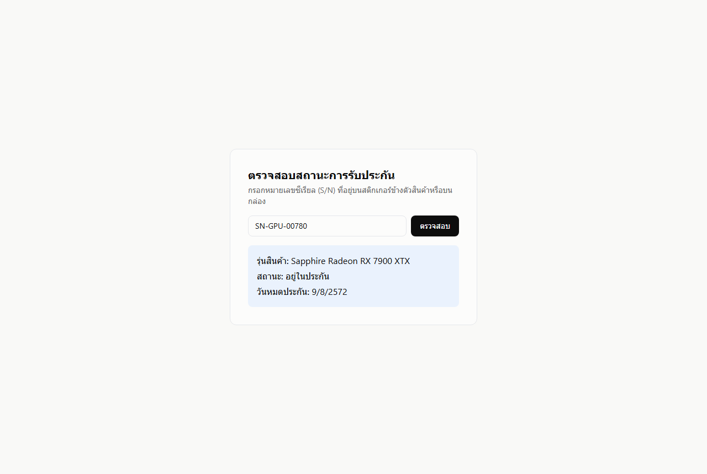

**1b. เช็คประกันด้วย S/N ผิดรูปแบบ — ข้อความบอกรูปแบบที่ถูกต้อง (NFR-USE-01)**

เดิมข้อความบอกแค่ "ไม่พบข้อมูล" ซึ่งเป็นทางตันสำหรับผู้ใช้ที่ไม่มีคนสอน — พบจากการเดิน task จริงตาม [06-Usability-Test](06-Usability-Test-NFR-USE-01.md)
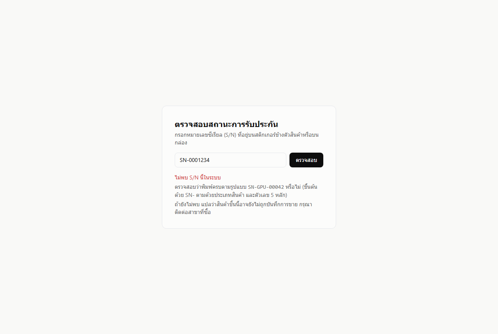

**2. Login (FR-007)**
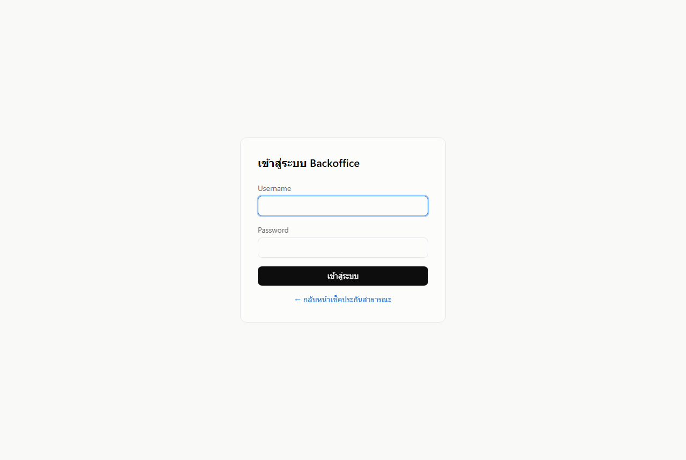

**3. Dashboard สำนักงานใหญ่ (FR-014, CR-013) — KPI 4 ตัว + กราฟยอดขายรายวันแยกสาขา**

การ์ดซ้ายสุดเทียบกับช่วงก่อนหน้าที่ยาวเท่ากัน (▲79%) · กราฟเส้นมีหนึ่งเส้นต่อหนึ่งสาขา แยกด้วยทั้งสีและลายเส้น คลิกชื่อสาขาเพื่อซ่อน/แสดงได้
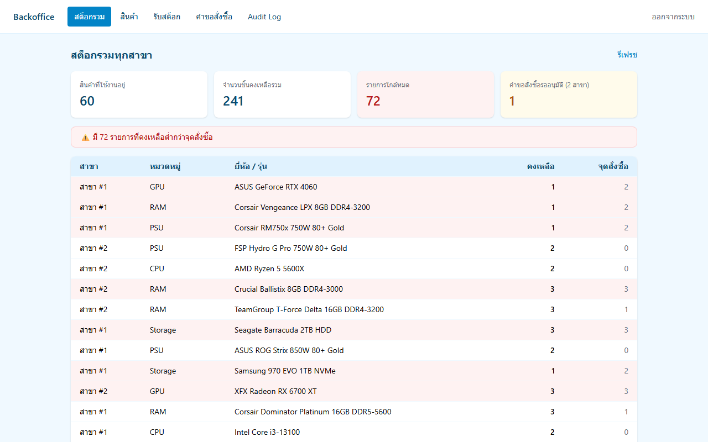

**3b. กราฟสินค้าขายดี + อัตราการระบายสต็อกรายสาขา**

อัตราระบาย = ขายได้ ÷ (ขายได้ + คงเหลือ) เทียบข้ามขนาดสาขาได้ ต่างจากยอดขายดิบที่สาขาใหญ่ชนะตลอด — กราฟนี้มาแทน "สต็อกตามหมวดหมู่" เดิมที่ถูกยกเลิกใน CR-013
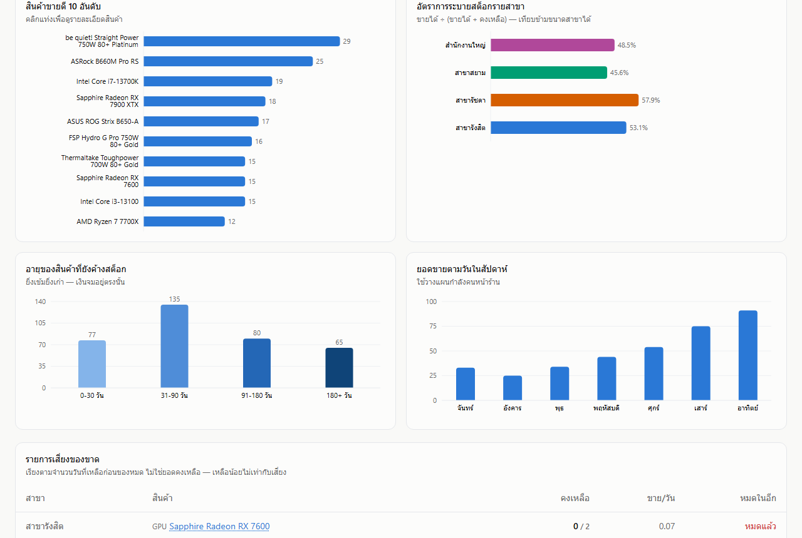

**3c. อายุสต็อก + ยอดขายตามวันในสัปดาห์**

อายุสต็อกใช้ไล่เฉดสีเดียวอ่อน→เข้ม เพราะถังอายุมีลำดับในตัว · รูปแบบสุดสัปดาห์ (ศ/ส/อา สูงกว่า จ/อ ชัดเจน) คำนวณตามปฏิทินไทย
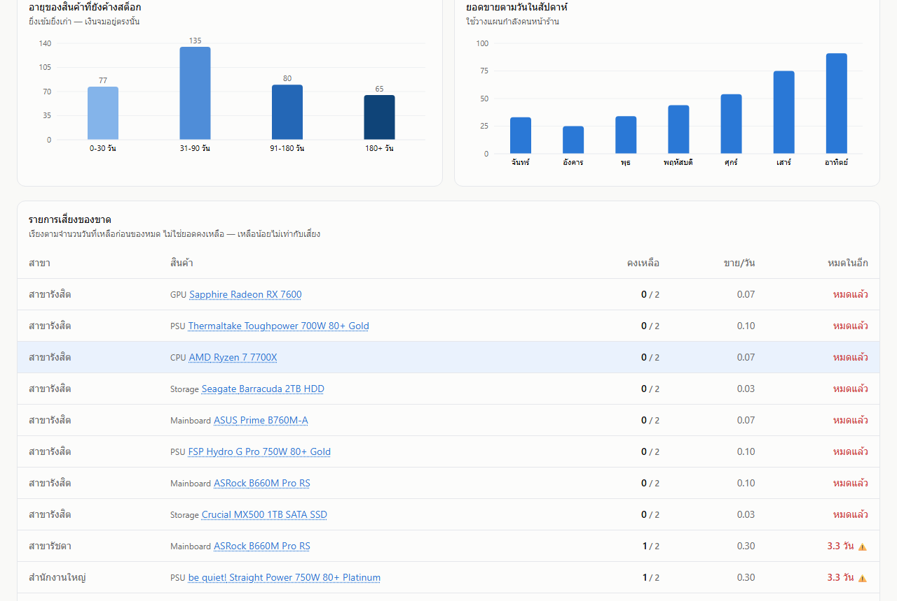

**3d. ตารางรายการเสี่ยงของขาด — เรียงตาม "จะหมดในกี่วัน" ไม่ใช่ยอดคงเหลือ**

เหลือน้อยไม่เท่ากับเสี่ยง: เหลือ 2 ชิ้นแต่ขายเดือนละชิ้นคือปลอดภัย ส่วนเหลือ 8 ชิ้นแต่ขายวันละ 2 ชิ้นคือใกล้หมดจริง
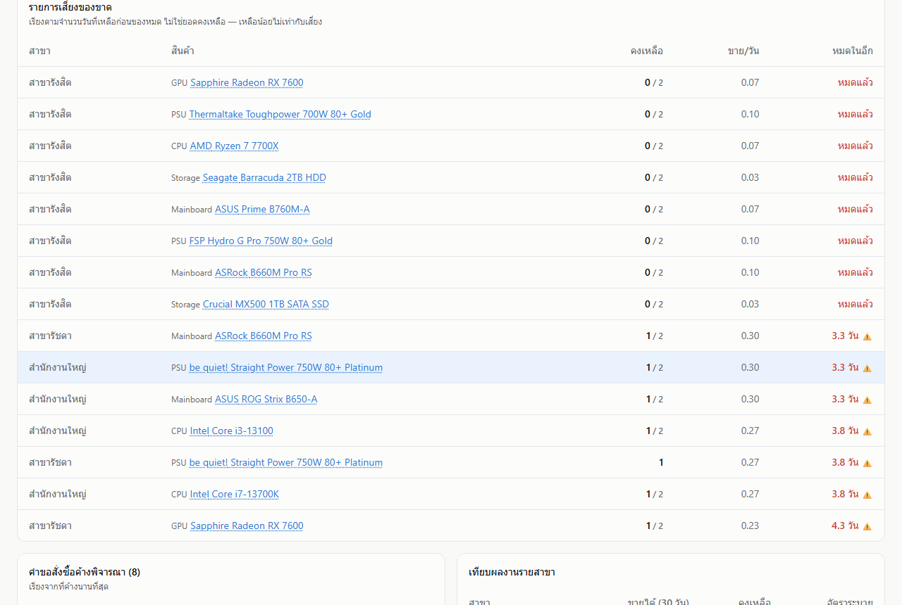

**3e. รายละเอียดสินค้า — คลิกแถวในตารางสต็อกหรือคลิกแท่งในกราฟ**

แสดงข้อมูลสินค้า รูป (FR-013) ยอดคงเหลือแยกสาขา และรายการ S/N รายชิ้นพร้อมสถานะ
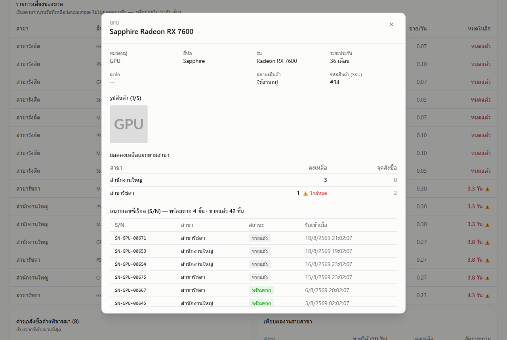

**4. จัดการรูปสินค้า (FR-013) — เพิ่ม/ลบได้สูงสุด 5 รูปต่อ SKU**
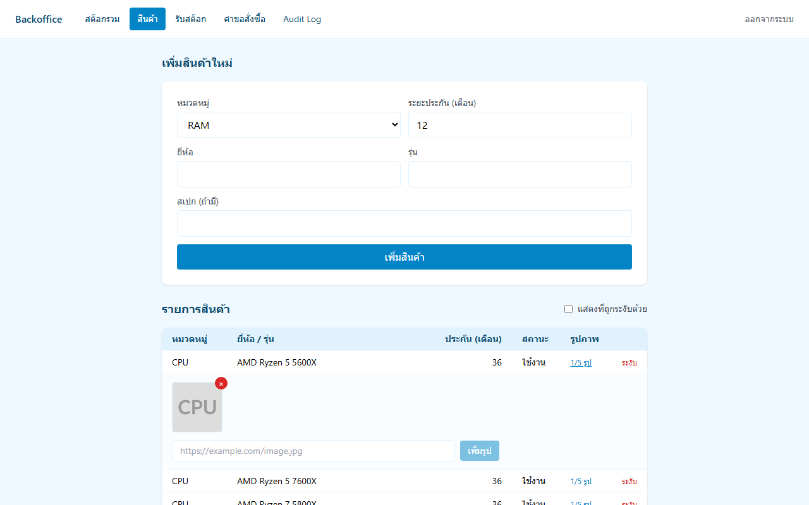

**5. คำขอสั่งซื้อรอดำเนินการ (FR-009/010)**
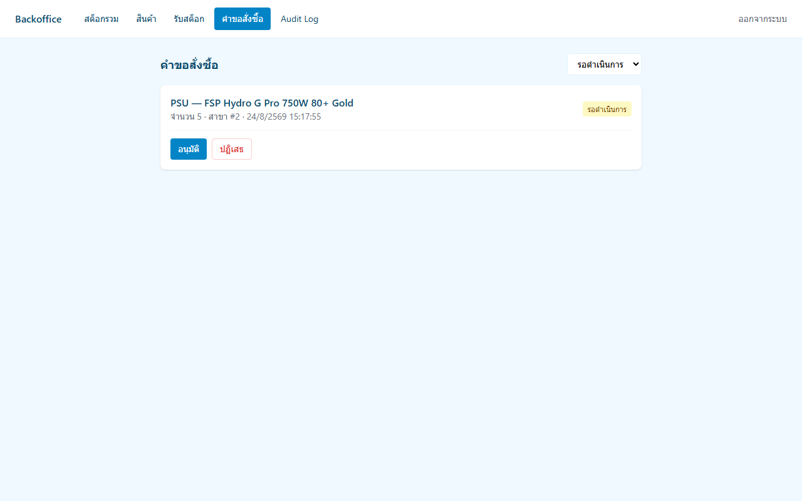

**6. Audit Log จริง (FR-011) — เห็น actor/action/before-after จากการ approve/reject/receive จริงที่เพิ่งทำ**
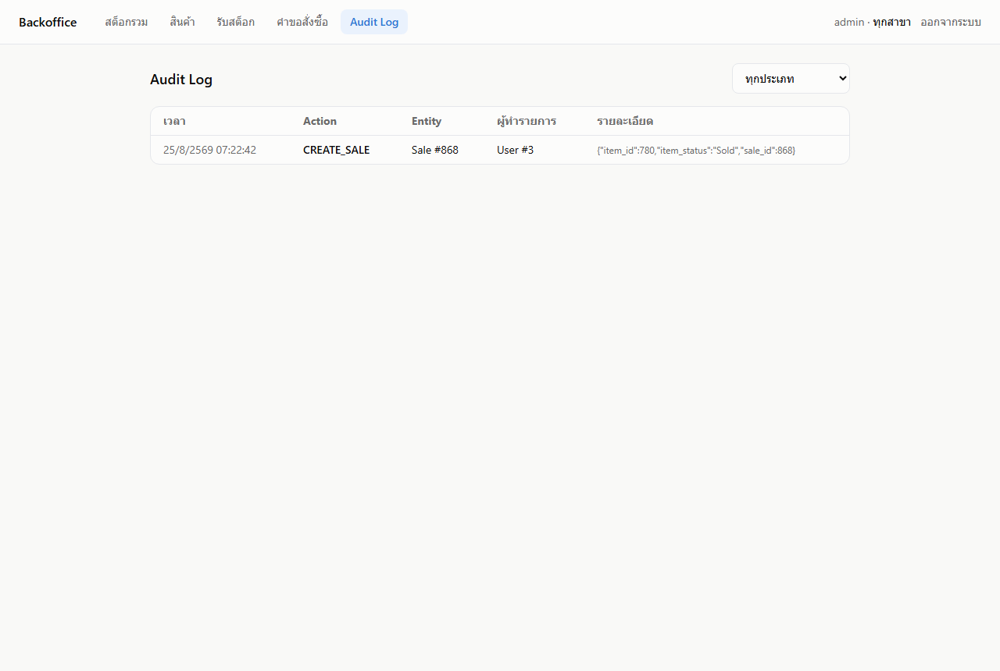

**7. Dashboard สาขา (FR-014, FR-008, CR-013) — ชุดย่อยที่ตัดข้อมูลสาขาอื่นออก**

ไม่มีตัวกรองสาขา ไม่มีกราฟเทียบสาขา และไม่มีตารางเทียบผลงาน เพราะสาขาไม่ควรเห็นตัวเลขของสาขาอื่น (NFR-SEC-02 บังคับที่ server อยู่แล้ว)
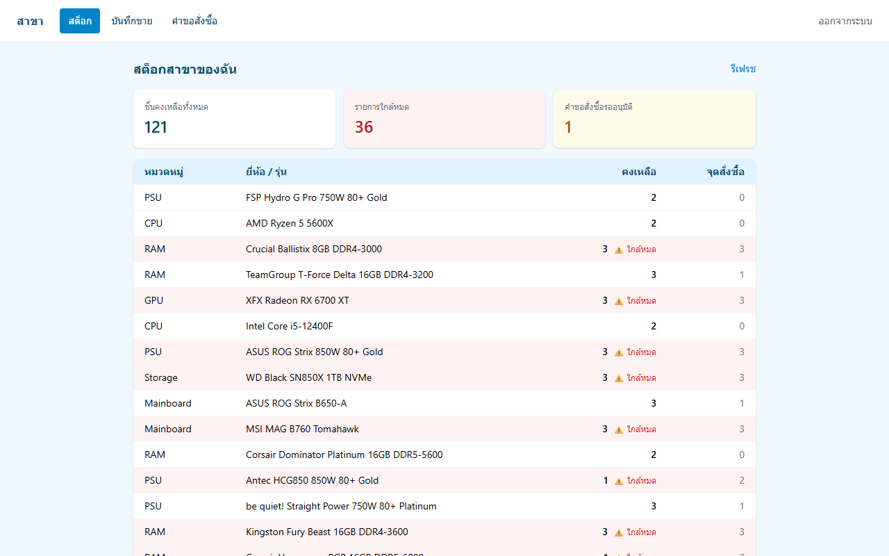

**7b. ตารางเสี่ยงของขาดฝั่งสาขา — มีปุ่ม "ขอสั่งซื้อ" ที่เปิดฟอร์มพร้อมเลือกสินค้าไว้ให้**

สาขาคือคนที่ลงมือขอเติมสต็อกจริง ปุ่มนี้จึงมีเฉพาะฝั่งสาขา ไม่มีในหน้าสำนักงานใหญ่
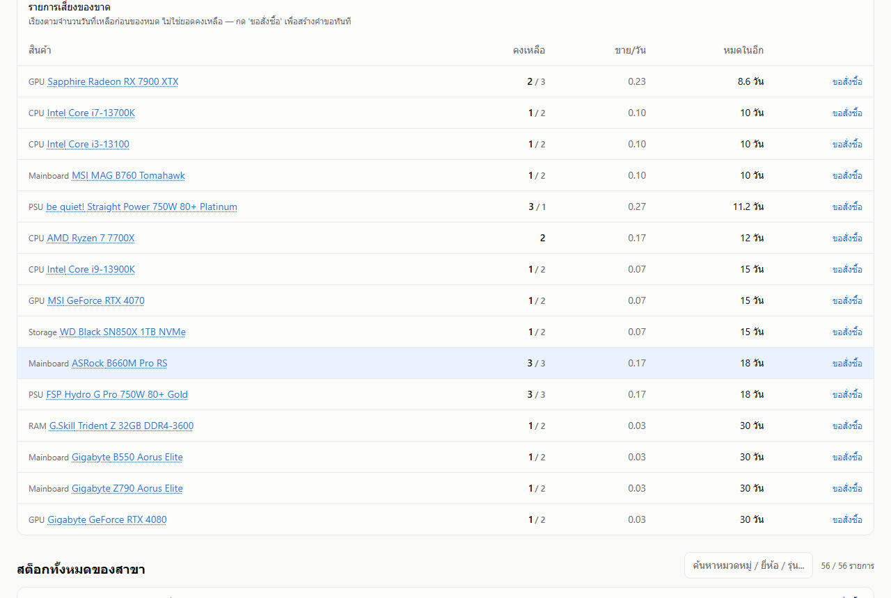

**8. บันทึกการขาย (FR-004/005, ADR-002) — ค้นหาด้วย S/N สำเร็จ**
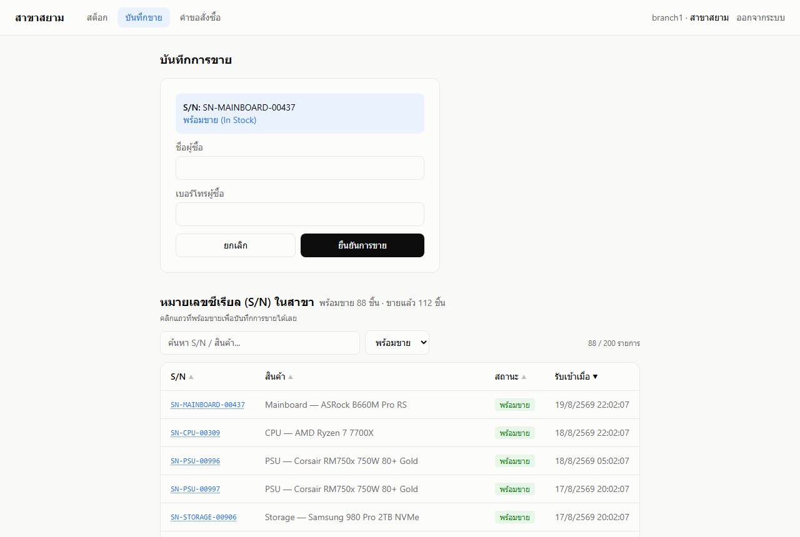

**8b. บันทึกการขายสำเร็จ พร้อมคำนวณวันหมดประกันอัตโนมัติ**
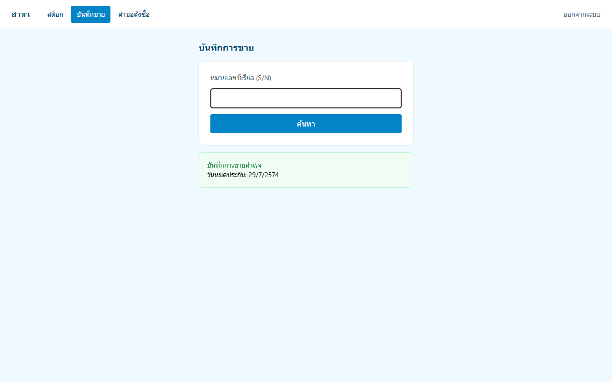

> ⚠️ **เปิดเผยตรง ๆ:** ภาพนี้ต้องขายจริงถึงจะถ่ายได้ ระหว่างถ่ายภาพชุดนี้ (รันสคริปต์ซ้ำหลายรอบเพื่อแก้บั๊กของสคริปต์เอง) จึงมีรายการขายชื่อผู้ซื้อ **"สมชาย ทดสอบระบบ" เบอร์ 0899999999** เกิดขึ้นบนฐานข้อมูลสาธิตหลายรายการ ถ้าเปิดดูรายการขายของสาขาสยามแล้วเจอชื่อซ้ำ ๆ นี่คือที่มา — ไม่ใช่ข้อมูลลูกค้าจริงและไม่ใช่บั๊ก

### Edge Case / Error Handling (ตามที่ Deck 05 กำหนดว่า demo ต้องมีอย่างน้อย 1 จุด)

**9. บันทึกการขายด้วย S/N ที่ไม่มีในสาขา — error message ชัดเจน ไม่ใช่ crash**
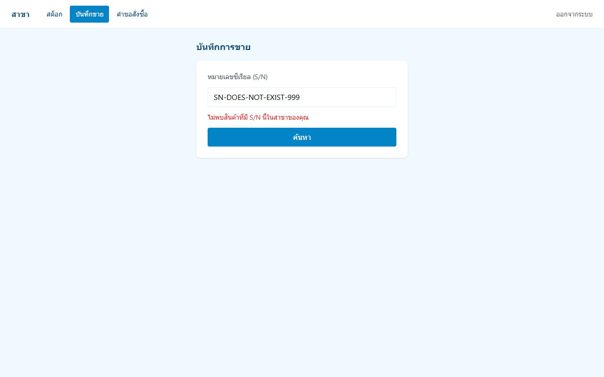

Edge case อื่นที่ verify แล้วจริงแต่ไม่มี screenshot แนบ (ดูใน AI Usage Log/test suite): ขายสินค้าเดิมซ้ำพร้อมกัน 10 thread → มีแค่ 1 สำเร็จ, ขาย item ที่ถูกขายไปแล้ว → 409, สาขาพยายามเข้าถึง endpoint ของ Admin → 403, S/N ปลอมที่หน้าเช็คประกันสาธารณะ → ข้อความบอกรูปแบบที่ถูกต้อง (ดูภาพ 1b)

---

## ⑩ Retrospective

เอกสารเต็มอยู่ที่ [04-Retrospective.md](04-Retrospective.md) — สรุปตามหัวข้อที่เกณฑ์กำหนด:

**What went well**
แก้ความเข้าใจผิดเรื่อง requirement ได้ตั้งแต่ก่อนเขียนโค้ด (Hardware = อะไหล่คอม ไม่ใช่เครื่องมือช่าง) ทำให้ Data Model ถูกตั้งแต่ต้น · concurrency control พิสูจน์ด้วย test 10 thread จริงบน Postgres จริง ไม่ใช่แค่อ้างว่าออกแบบไว้ · deploy ขึ้น production จริงและตรวจซ้ำได้ทุกครั้ง

**What went wrong**
ประเมิน timeline ผิด 3 รอบจนต้องรื้อ priority ใหม่ทั้งชุด · scope ขยายผ่าน CR 15 ครั้ง สะท้อนว่า elicitation แรกไม่ครอบคลุมพอ · บั๊ก encoding บน Windows ซ้ำหลายรอบเพราะไม่ตั้ง `PYTHONUTF8=1` ตั้งแต่ต้น · **ใช้ branch/PR ช้าเกินไป — 38 commit แรก push ตรงเข้า `main`**

**What we learned**
บทเรียนที่ใหญ่ที่สุดคือ **บั๊กที่อันตรายที่สุดคือบั๊กที่ไม่ทำให้อะไรพัง** — จัดกลุ่มเวลาด้วย UTC แทนเวลาไทยจนกราฟผิดวันทั้งที่หน้าจอดูปกติ · test ที่ fail ไม่ได้เพราะดักฟัง engine ผิดตัว · เครื่องมือวัดที่รายงานผ่านหมดเพราะสลับลำดับพารามิเตอร์ · KPI 2 ตัวบนหน้าจอเดียวกันที่นิยามต่างกัน 1 หน่วย · ทุกตัวถูกจับได้เพราะ **รันจริงแล้ววัดผล ไม่ใช่เพราะอ่านโค้ดซ้ำ** และหลายตัวจับได้เพราะเอา test ไปรันกับโค้ดที่ยังผิด เพื่อดูว่ามัน fail จริงไหม

**What we would improve**
ยืนยัน scope/timeline ให้นิ่งก่อนเริ่ม · ตั้ง isolated venv ตั้งแต่ commit แรก · **บังคับ branch protection ด้วยเครื่องมือ ไม่ใช่ด้วยความตั้งใจ** (โครงงานนี้พิสูจน์เองแล้วว่าตั้งใจไว้ในแผนสัปดาห์ 2 แต่จริง ๆ เริ่มทำตอน commit ที่ 39) · หาเพื่อนร่วมชั้นสลับกันรีวิว PR เพราะ PR ที่ไม่มีใครรีวิวยังไม่ใช่ code review · แทรก usability test คู่ขนานกับการพัฒนา UI แทนที่จะทิ้งไว้สัปดาห์สุดท้าย

**Technical Debt ที่ยังเหลือ** — ตารางเต็มใน [Retrospective §3](04-Retrospective.md) และ [Known Issues 8 ข้อ](07-Release-Notes.md)

---


## ⑪ Appendix

### Technical Evidence — ตำแหน่งของแต่ละหลักฐาน

| Evidence Area | สิ่งที่ต้องมี | อยู่ที่ไหน |
|---|---|---|
| **Architecture** | Context/Component Diagram · Data Model · API Contract · Design Decisions | [03 §1 Context](03-Architecture-Design.md) · [§2 Component](03-Architecture-Design.md) · §6 ER Model · §7 REST API · ADR-001/002/003 |
| **Code** | Git repo · commits · branching · PR · coding standard · README | [repo](https://github.com/kit-sinlapasa/sme-inventory-system) · [PR ทั้งหมด](https://github.com/kit-sinlapasa/sme-inventory-system/pulls?q=is%3Apr) · `ruff` ใน `backend/pyproject.toml` · [README](../README.md) |
| **Test** | Unit/Integration/System/Acceptance + test report | [`evidence/test-report.md`](evidence/test-report.md) — **122 เคส ครบ 4 ระดับ** · trace กลับ requirement ในคอลัมน์สุดท้ายของตาราง |
| **CI/CD** | Pipeline + **ภาพหรือ log ที่ทำงานจริง** | [`evidence/ci-pipeline-log.md`](evidence/ci-pipeline-log.md) — log จาก run จริงดึงด้วย `gh run view` · [.github/workflows/ci.yml](../.github/workflows/ci.yml) |
| **Release** | Version/Tag · environment · deployment evidence · rollback/known issues | [`07-Release-Notes.md`](07-Release-Notes.md) — tag **`v1.1.0`** · known issues 8 ข้อ |
| **Security** | Threat/Risk · secrets handling · dependency/license check | [03 §9 STRIDE](03-Architecture-Design.md) · §11 Hardening (`pip-audit`/`npm audit`) · [LICENSE](../LICENSE) + ตรวจ license ของ dependency 16 ตัว |

### ⚠️ Contribution ของสมาชิก — บันทึกตรงไปตรงมา

เกณฑ์ระบุว่า **"มี contribution จากสมาชิกทุกคน"** — โครงงานนี้ทำโดย**คนเดียว**ร่วมกับ AI
ประวัติ git จึงมีผู้เขียนคนเดียว (`kit-sinlapasa`) และ commit ทุกอันมี `Co-Authored-By: Claude`
กำกับไว้ตามจริงว่า AI มีส่วนร่วมในการเขียน — ไม่ได้แสร้งว่าเป็นงานที่เขียนเองล้วน

ตรวจสอบได้ด้วย `git log --format='%an <%ae>' | sort -u` และ `git log --grep='Co-Authored-By'`


### Source / Repository

- Repo: https://github.com/kit-sinlapasa/sme-inventory-system
- CI: https://github.com/kit-sinlapasa/sme-inventory-system/actions
- Live Frontend: https://sme-inventory-frontend.onrender.com
- Live API + OpenAPI docs: https://sme-inventory-api.onrender.com/docs

### Test Evidence

- Full test suite: `backend/tests/` — จำนวนล่าสุดตรวจซ้ำได้ด้วย `python -m pytest -q` (ณ วันเขียน 122 ผ่านทั้งหมด) · ตัวเลขนี้เคยล้าสมัย 2 รอบเพราะฝังไว้เฉย ๆ จึงระบุคำสั่งกำกับไว้ให้ตรวจเองได้
- Load test script: `backend/scripts/load_test.py`
- CI logs: ดูที่ GitHub Actions run history ของ repo (เขียวทุกครั้งตั้งแต่สัปดาห์ 2)

### CI Logs

ดู Actions tab ของ repo โดยตรง — ทุก push มี job `backend-test` (pytest + lint) และ `frontend-build` (npm build) แยกกัน พร้อม timestamp และ log เต็ม

### Meeting / Contribution Evidence

_[ทีมยังไม่ได้เพิ่มหลักฐานการประชุม/แบ่งงานในส่วนนี้ — ต้องเติมก่อนส่งจริง ดู Individual Contribution Summary ใน §⑤ ด้วย]_

### เอกสารประกอบทั้งหมด

| เอกสาร | เนื้อหา |
|---|---|
| [01-Requirements-Package.md](01-Requirements-Package.md) | Problem Statement, Stakeholder, FR/NFR เต็ม, User Story+AC, RTM, Change Log |
| [02-AI-Usage-Log.md](02-AI-Usage-Log.md) | AI Usage Disclosure Log ฉบับเต็ม (31 entries) |
| [03-Architecture-Design.md](03-Architecture-Design.md) | ADR, ER Model, API Spec, User Flow, Diagrams, STRIDE, Security Hardening |
| [04-Retrospective.md](04-Retrospective.md) | สิ่งที่สำเร็จ, ปัญหาจริง, Technical Debt, บทเรียน |
| [README.md](../README.md) | Quick Start, สถานะการพัฒนาปัจจุบัน, Test Login |
